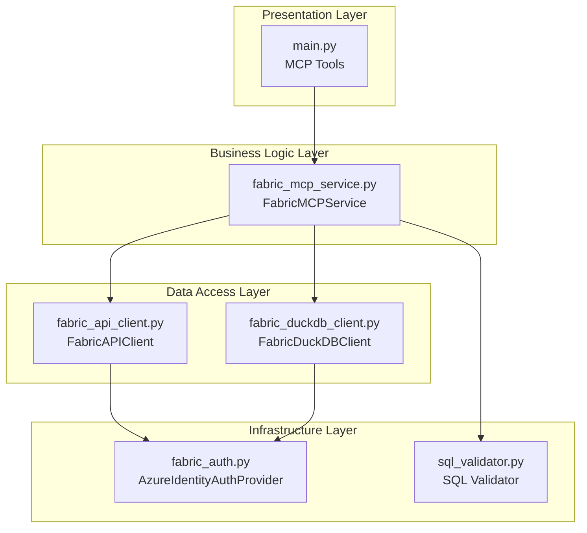
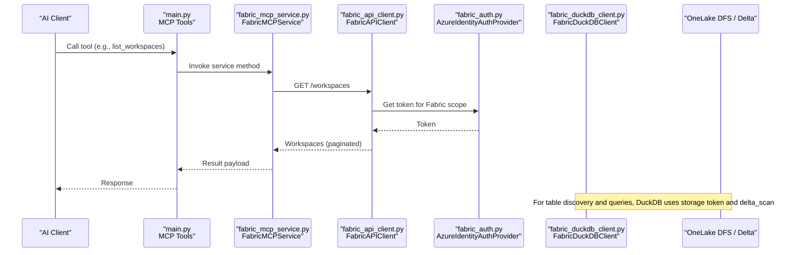
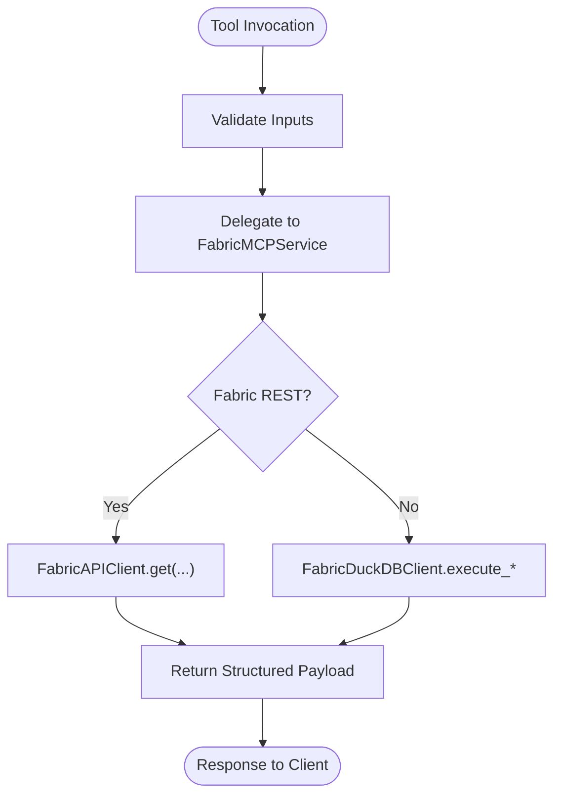
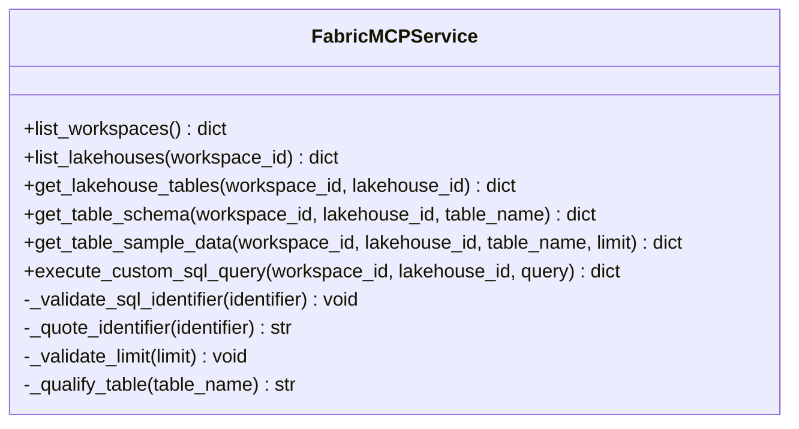
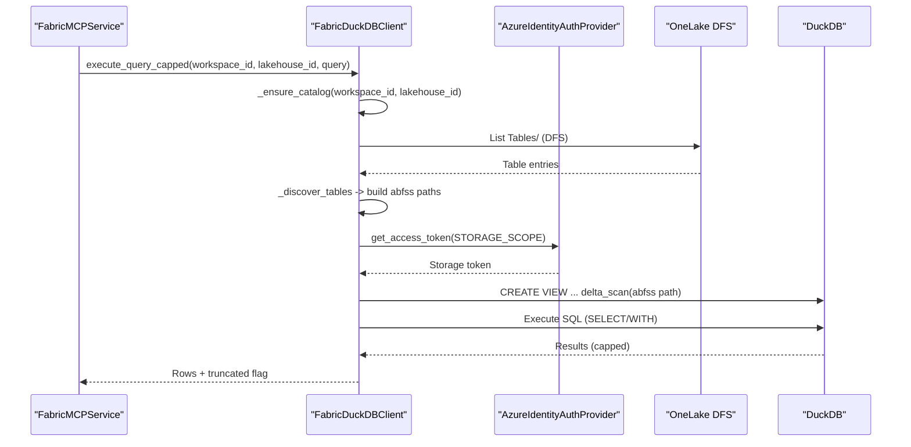
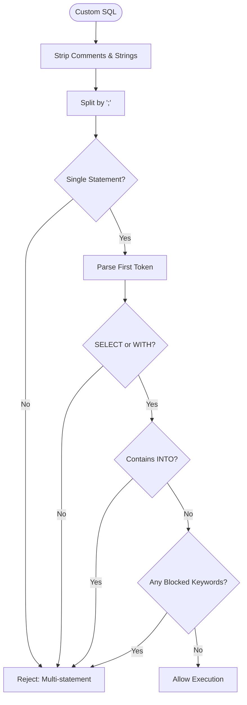
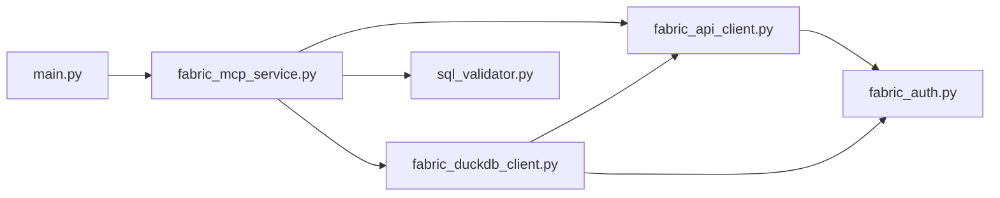
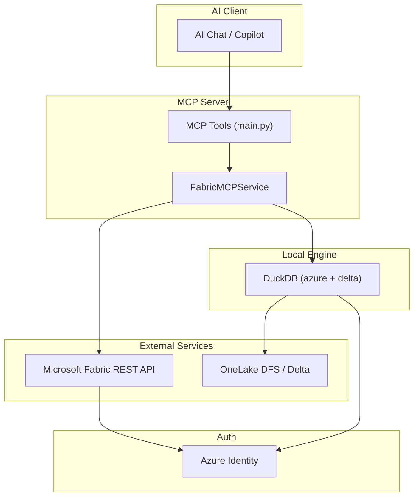

# Architecture Overview

<cite>
**Referenced Files in This Document**
- [main.py](file://main.py)
- [fabric_mcp_service.py](file://fabric_mcp_service.py)
- [fabric_api_client.py](file://fabric_api_client.py)
- [fabric_auth.py](file://fabric_auth.py)
- [fabric_duckdb_client.py](file://fabric_duckdb_client.py)
- [sql_validator.py](file://sql_validator.py)
- [requirements.txt](file://requirements.txt)
- [PLAN.md](file://PLAN.md)
- [README.md](file://README.md)
</cite>

## Table of Contents
1. [Introduction](#introduction)
2. [Project Structure](#project-structure)
3. [Core Components](#core-components)
4. [Architecture Overview](#architecture-overview)
5. [Detailed Component Analysis](#detailed-component-analysis)
6. [Dependency Analysis](#dependency-analysis)
7. [Performance Considerations](#performance-considerations)
8. [Troubleshooting Guide](#troubleshooting-guide)
9. [Conclusion](#conclusion)
10. [Appendices](#appendices)

## Introduction
This document describes the architecture of the Fabric MCP Server, a Model Context Protocol (MCP) server that exposes tools for exploring Microsoft Fabric workspaces and OneLake lakehouses. It provides:
- Discovery of workspaces and lakehouses via Microsoft Fabric REST APIs
- Enumeration of Delta tables in OneLake
- Schema inspection and sample data retrieval
- Local SQL execution against OneLake Delta using DuckDB with SELECT-only enforcement

The system is layered to separate presentation (MCP tools), business logic (service orchestration), data access (API clients), and infrastructure (authentication, validation). It uses async patterns for I/O-bound operations and enforces strict security constraints on custom SQL.

## Project Structure
The project is organized into focused modules:
- Presentation layer: MCP tool definitions exposed to AI clients
- Service layer: Orchestration of API calls, validation, and query execution
- Data access layer: HTTP client for Fabric REST and DuckDB client for OneLake Delta
- Infrastructure layer: Authentication via Azure Identity and SQL validation utilities

**Diagram sources**
- [main.py:24-143](file://main.py#L24-L143)
- [fabric_mcp_service.py:14-152](file://fabric_mcp_service.py#L14-L152)
- [fabric_api_client.py:13-58](file://fabric_api_client.py#L13-L58)
- [fabric_duckdb_client.py:124-438](file://fabric_duckdb_client.py#L124-L438)
- [fabric_auth.py:14-63](file://fabric_auth.py#L14-L63)
- [sql_validator.py:80-105](file://sql_validator.py#L80-L105)

**Section sources**
- [main.py:1-152](file://main.py#L1-L152)
- [PLAN.md:25-29](file://PLAN.md#L25-L29)

## Core Components
- MCP Tools: Expose functions like list_workspaces, list_lakehouses, get_lakehouse_tables, get_table_schema, get_table_sample_data, execute_custom_sql_query
- Service Layer: Validates inputs, orchestrates calls to REST and DuckDB, handles errors and result shaping
- REST Client: Paginates responses from Fabric REST API and attaches tokens
- DuckDB Client: Discovers tables via OneLake DFS, lazily registers views over delta_scan, executes queries locally
- Auth Provider: Acquires tokens for Fabric REST and OneLake storage via Azure Identity
- SQL Validator: Enforces SELECT-only policy and blocks dangerous keywords

Key responsibilities and interactions are detailed in subsequent sections.

**Section sources**
- [main.py:35-143](file://main.py#L35-L143)
- [fabric_mcp_service.py:14-152](file://fabric_mcp_service.py#L14-L152)
- [fabric_api_client.py:13-58](file://fabric_api_client.py#L13-L58)
- [fabric_duckdb_client.py:124-438](file://fabric_duckdb_client.py#L124-L438)
- [fabric_auth.py:14-63](file://fabric_auth.py#L14-L63)
- [sql_validator.py:80-105](file://sql_validator.py#L80-L105)

## Architecture Overview
The system follows a layered architecture with clear separation of concerns:
- Presentation: FastMCP tools define the interface for AI clients
- Business Logic: FabricMCPService coordinates workflows and error handling
- Data Access: FabricAPIClient interacts with Microsoft Fabric REST; FabricDuckDBClient runs local SQL against OneLake Delta
- Infrastructure: AzureIdentityAuthProvider secures both REST and storage access; sql_validator ensures safe SQL execution

**Diagram sources**
- [main.py:35-59](file://main.py#L35-L59)
- [fabric_mcp_service.py:56-66](file://fabric_mcp_service.py#L56-L66)
- [fabric_api_client.py:21-49](file://fabric_api_client.py#L21-L49)
- [fabric_auth.py:34-42](file://fabric_auth.py#L34-L42)
- [fabric_duckdb_client.py:163-209](file://fabric_duckdb_client.py#L163-L209)

## Detailed Component Analysis

### Presentation Layer: MCP Tools
- Purpose: Define user-facing tools for workspace/lakehouse exploration and SQL querying
- Behavior: Each tool delegates to FabricMCPService methods and returns structured payloads
- Notable tools:
  - list_workspaces: Returns workspace id and name
  - list_lakehouses(workspace_id): Returns lakehouse id and name
  - get_lakehouse_tables(workspace_id, lakehouse_id): Returns schema, name, type, full_name
  - get_table_schema(workspace_id, lakehouse_id, table_name): Returns column metadata
  - get_table_sample_data(workspace_id, lakehouse_id, table_name, limit): Returns first N rows
  - execute_custom_sql_query(workspace_id, lakehouse_id, query): Runs SELECT-only DuckDB query with row cap

**Diagram sources**
- [main.py:35-143](file://main.py#L35-L143)
- [fabric_mcp_service.py:56-152](file://fabric_mcp_service.py#L56-L152)

**Section sources**
- [main.py:35-143](file://main.py#L35-L143)

### Business Logic Layer: FabricMCPService
- Responsibilities:
  - Input validation (identifiers, limits, table qualification)
  - Orchestration of REST and DuckDB operations
  - Error handling and consistent response shapes
- Key methods:
  - list_workspaces: Calls REST to enumerate workspaces
  - list_lakehouses(workspace_id): Calls REST to enumerate lakehouses
  - get_lakehouse_tables(workspace_id, lakehouse_id): Uses DuckDB client to list tables
  - get_table_schema(workspace_id, lakehouse_id, table_name): Describes columns via DuckDB
  - get_table_sample_data(...): Builds LIMIT query and fetches rows
  - execute_custom_sql_query(...): Validates SQL and executes with capped results

**Diagram sources**
- [fabric_mcp_service.py:14-152](file://fabric_mcp_service.py#L14-L152)

**Section sources**
- [fabric_mcp_service.py:14-152](file://fabric_mcp_service.py#L14-L152)

### Data Access Layer: REST and DuckDB Clients
- FabricAPIClient:
  - Base URL and scope for Fabric REST
  - Token acquisition via auth provider
  - Async HTTP requests with timeout and pagination support
  - Unified get/post/put/delete methods
- FabricDuckDBClient:
  - Manages DuckDB connection lifecycle and extensions (azure, delta)
  - Refreshes Azure secret per query to maintain valid storage token
  - Discovers tables by listing OneLake DFS directories under Tables/
  - Lazily creates views over delta_scan for referenced tables only
  - Executes queries locally, returning JSON-like records with truncation detection

**Diagram sources**
- [fabric_duckdb_client.py:227-256](file://fabric_duckdb_client.py#L227-L256)
- [fabric_duckdb_client.py:322-333](file://fabric_duckdb_client.py#L322-L333)
- [fabric_duckdb_client.py:369-392](file://fabric_duckdb_client.py#L369-L392)
- [fabric_auth.py:34-42](file://fabric_auth.py#L34-L42)

**Section sources**
- [fabric_api_client.py:13-58](file://fabric_api_client.py#L13-L58)
- [fabric_duckdb_client.py:124-438](file://fabric_duckdb_client.py#L124-L438)

### Infrastructure Layer: Authentication and Validation
- Authentication:
  - AzureIdentityAuthProvider supports az login (DefaultAzureCredential) or service principal (ClientSecretCredential)
  - Separate scopes for Fabric REST and OneLake storage
  - Token caching handled by azure-identity; secrets refreshed per query for DuckDB
- SQL Validation:
  - assert_select_only enforces single SELECT or WITH…SELECT
  - Blocks dangerous keywords and multi-statement batches
  - Strips comments and strings before analysis to avoid bypass

**Diagram sources**
- [sql_validator.py:47-105](file://sql_validator.py#L47-L105)

**Section sources**
- [fabric_auth.py:14-63](file://fabric_auth.py#L14-L63)
- [sql_validator.py:80-105](file://sql_validator.py#L80-L105)

## Dependency Analysis
High-level dependencies among components:
- main.py depends on fabric_mcp_service.py for all tool implementations
- fabric_mcp_service.py depends on fabric_api_client.py, fabric_duckdb_client.py, and sql_validator.py
- fabric_api_client.py depends on fabric_auth.py for token acquisition
- fabric_duckdb_client.py depends on fabric_auth.py and fabric_api_client.py for catalog refresh and storage tokens
- External integrations: Microsoft Fabric REST API, OneLake DFS, DuckDB engine

**Diagram sources**
- [main.py:22-28](file://main.py#L22-L28)
- [fabric_mcp_service.py:8-11](file://fabric_mcp_service.py#L8-L11)
- [fabric_api_client.py:7-7](file://fabric_api_client.py#L7-L7)
- [fabric_duckdb_client.py:13-15](file://fabric_duckdb_client.py#L13-L15)

**Section sources**
- [requirements.txt:1-7](file://requirements.txt#L1-L7)
- [PLAN.md:25-29](file://PLAN.md#L25-L29)

## Performance Considerations
- Local compute: DuckDB runs on the client machine, avoiding Fabric Spark/SQL CU costs
- Lazy view registration: Only referenced tables are registered as views via delta_scan, reducing overhead
- Row caps: Custom SQL results capped at 1000 rows to prevent large transfers
- Pagination: REST client paginates through continuation tokens to retrieve complete lists
- Network efficiency: Range reads of Delta logs and Parquet files directly from OneLake without copying entire datasets
- Concurrency: Async I/O for HTTP requests; threading used to run CPU-bound DuckDB operations off the event loop

Optimization opportunities:
- Connection pooling for HTTP clients if multiple concurrent requests are expected
- Caching of table catalogs per workspace/lakehouse session to reduce DFS listings
- Query plan hints or pre-aggregation strategies for complex joins

[No sources needed since this section provides general guidance]

## Troubleshooting Guide
Common issues and resolutions:
- Token acquisition fails:
  - Ensure az login targets the same tenant as Fabric
  - Verify identity has Workspace Viewer or higher roles
  - For service principal, ensure FABRIC_CLIENT_ID, FABRIC_CLIENT_SECRET, FABRIC_TENANT_ID are set correctly
- DuckDB/OneLake read failures:
  - First run downloads DuckDB azure and delta extensions; requires network access
  - Use GUIDs for workspace/lakehouse identifiers to avoid known OneLake list bugs
  - If encountering “no files in log segment,” retry; GUID paths mitigate certain OneLake issues
- Tools not appearing:
  - Confirm MCP command points to .venv Python executable
  - Restart MCP server after dependency changes

Error handling patterns:
- Service layer wraps exceptions and returns structured error fields in responses
- REST client raises exceptions on non-200 status codes with message body
- DuckDB client includes helpful hints for permission and configuration issues

**Section sources**
- [README.md:227-249](file://README.md#L227-L249)
- [fabric_api_client.py:21-31](file://fabric_api_client.py#L21-L31)
- [fabric_duckdb_client.py:183-202](file://fabric_duckdb_client.py#L183-L202)

## Conclusion
The Fabric MCP Server implements a clean, layered architecture that separates presentation, business logic, data access, and infrastructure concerns. It leverages Microsoft Fabric REST APIs for resource discovery and DuckDB for local SQL execution against OneLake Delta, enforcing strict security policies for custom queries. The design prioritizes performance through lazy view registration, row caps, and efficient network usage, while providing robust error handling and clear integration patterns for AI clients.

[No sources needed since this section summarizes without analyzing specific files]

## Appendices

### System Context Diagram
Shows how components communicate and data moves through the system:

**Diagram sources**
- [main.py:24-143](file://main.py#L24-L143)
- [fabric_mcp_service.py:14-152](file://fabric_mcp_service.py#L14-L152)
- [fabric_api_client.py:13-58](file://fabric_api_client.py#L13-L58)
- [fabric_duckdb_client.py:124-438](file://fabric_duckdb_client.py#L124-L438)
- [fabric_auth.py:14-63](file://fabric_auth.py#L14-L63)

### Deployment Topology Options
- Local development: Run via stdio transport for VS Code/Cursor integration
- Containerized deployment: Package Python environment with dependencies for reproducible execution
- Cloud-hosted worker: Deploy as a managed process behind an API gateway if scaling beyond local use is required

Scalability considerations:
- Horizontal scaling can be achieved by running multiple instances behind a load balancer if exposing via HTTP rather than stdio
- Connection limits and rate limiting should be considered when interacting with OneLake and Fabric REST endpoints
- Caching strategies (catalog, tokens) can reduce external calls and improve latency

[No sources needed since this section provides general guidance]