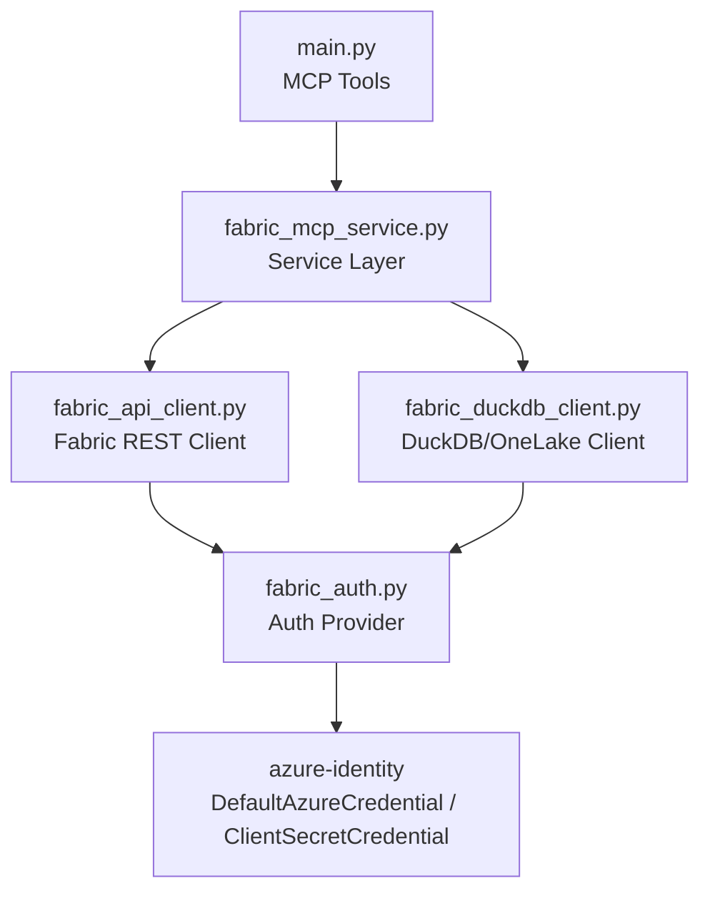
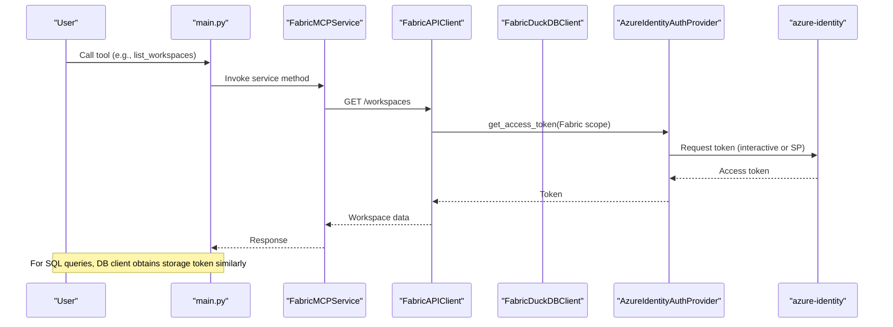
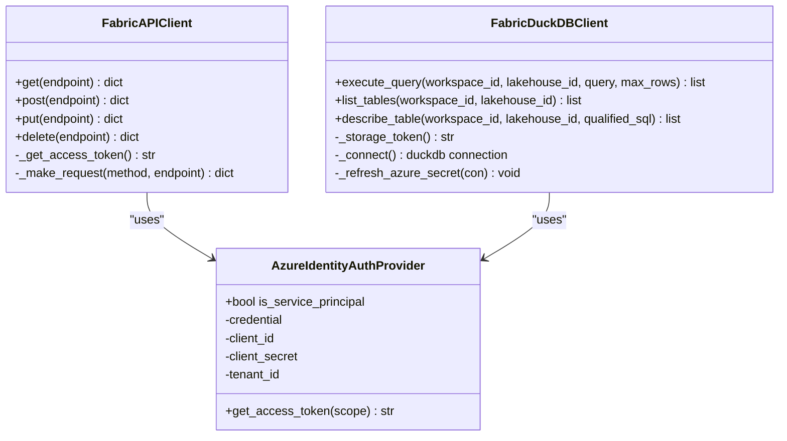
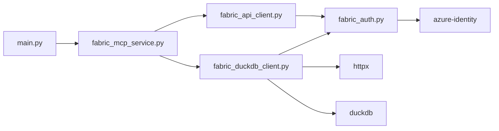

# Authentication System

<cite>
**Referenced Files in This Document**
- [fabric_auth.py](file://fabric_auth.py)
- [main.py](file://main.py)
- [fabric_mcp_service.py](file://fabric_mcp_service.py)
- [fabric_api_client.py](file://fabric_api_client.py)
- [fabric_duckdb_client.py](file://fabric_duckdb_client.py)
- [sql_validator.py](file://sql_validator.py)
- [README.md](file://README.md)
- [.env.example](file://.env.example)
</cite>

## Table of Contents
1. [Introduction](#introduction)
2. [Project Structure](#project-structure)
3. [Core Components](#core-components)
4. [Architecture Overview](#architecture-overview)
5. [Detailed Component Analysis](#detailed-component-analysis)
6. [Dependency Analysis](#dependency-analysis)
7. [Performance Considerations](#performance-considerations)
8. [Troubleshooting Guide](#troubleshooting-guide)
9. [Conclusion](#conclusion)
10. [Appendices](#appendices)

## Introduction
This document explains the dual authentication system that supports:
- Interactive Azure CLI authentication (device code flow via DefaultAzureCredential)
- Service principal authentication (client credentials via ClientSecretCredential)

It covers the authentication flow, token acquisition process, credential management, environment variables for service principals, security best practices, token caching behavior, error handling, and integration with Microsoft Fabric permissions. It also provides troubleshooting guidance for common issues such as tenant mismatches and permission problems.

## Project Structure
The authentication system is implemented across a small set of focused modules:
- Authentication provider abstraction and factory
- MCP server entry point exposing tools
- Service layer wiring clients to the auth provider
- REST API client using Fabric scopes
- DuckDB client using storage scopes for OneLake access
- SQL validator to enforce read-only queries

**Diagram sources**
- [main.py:1-152](file://main.py#L1-L152)
- [fabric_mcp_service.py:1-153](file://fabric_mcp_service.py#L1-L153)
- [fabric_api_client.py:1-59](file://fabric_api_client.py#L1-L59)
- [fabric_duckdb_client.py:1-438](file://fabric_duckdb_client.py#L1-L438)
- [fabric_auth.py:1-64](file://fabric_auth.py#L1-L64)

**Section sources**
- [main.py:1-152](file://main.py#L1-L152)
- [fabric_mcp_service.py:1-153](file://fabric_mcp_service.py#L1-L153)
- [fabric_api_client.py:1-59](file://fabric_api_client.py#L1-L59)
- [fabric_duckdb_client.py:1-438](file://fabric_duckdb_client.py#L1-L438)
- [fabric_auth.py:1-64](file://fabric_auth.py#L1-L64)

## Core Components
- AzureIdentityAuthProvider: Wraps azure-identity credentials and exposes get_access_token for requested scopes.
- create_auth_provider_from_env(): Factory that selects interactive or service principal mode based on environment variables.
- FabricAPIClient: Adds Authorization headers using tokens scoped to Fabric APIs.
- FabricDuckDBClient: Acquires storage tokens for OneLake and configures DuckDB secrets for Delta reads.
- FabricMCPService: Initializes clients and routes tool calls through them.

Key responsibilities:
- Credential selection and validation
- Token acquisition per scope
- Transparent injection into HTTP requests and DuckDB connections
- Error propagation and user-friendly responses

**Section sources**
- [fabric_auth.py:14-64](file://fabric_auth.py#L14-L64)
- [fabric_api_client.py:13-59](file://fabric_api_client.py#L13-L59)
- [fabric_duckdb_client.py:124-162](file://fabric_duckdb_client.py#L124-L162)
- [fabric_mcp_service.py:14-19](file://fabric_mcp_service.py#L14-L19)

## Architecture Overview
The system uses a layered architecture where the MCP tools call the service layer, which delegates to specialized clients. All network-bound operations obtain tokens from the auth provider. The provider chooses between interactive and service principal flows based on environment configuration.

**Diagram sources**
- [main.py:35-44](file://main.py#L35-L44)
- [fabric_mcp_service.py:56-66](file://fabric_mcp_service.py#L56-L66)
- [fabric_api_client.py:18-31](file://fabric_api_client.py#L18-L31)
- [fabric_auth.py:34-42](file://fabric_auth.py#L34-L42)

## Detailed Component Analysis

### Authentication Provider and Factory
- Mode selection: If FABRIC_CLIENT_SECRET is present, use ClientSecretCredential; otherwise, use DefaultAzureCredential with interactive browser excluded.
- Validation: When using service principal, requires both FABRIC_CLIENT_ID and FABRIC_TENANT_ID.
- Token acquisition: get_access_token accepts one or multiple scopes and returns the first successful token or raises an exception with the last error.

Environment variables:
- FABRIC_CLIENT_ID
- FABRIC_CLIENT_SECRET
- FABRIC_TENANT_ID

Security notes:
- Never commit .env files containing secrets.
- Use least privilege for service principals.

**Section sources**
- [fabric_auth.py:14-64](file://fabric_auth.py#L14-L64)
- [.env.example:1-12](file://.env.example#L1-L12)

#### Class Diagram

**Diagram sources**
- [fabric_auth.py:14-64](file://fabric_auth.py#L14-L64)
- [fabric_api_client.py:13-59](file://fabric_api_client.py#L13-L59)
- [fabric_duckdb_client.py:124-162](file://fabric_duckdb_client.py#L124-L162)

### REST API Client (FabricAPIClient)
- Scope: Uses Fabric API scope for tokens.
- Behavior: Adds Authorization header to all requests and handles pagination by following continuation tokens.
- Error handling: Raises exceptions for non-200 responses with status and body.

Integration points:
- Called by service layer for workspace and lakehouse discovery.

**Section sources**
- [fabric_api_client.py:9-59](file://fabric_api_client.py#L9-L59)

### DuckDB Client (FabricDuckDBClient)
- Storage scope: Uses storage scope for OneLake access.
- Secret refresh: Creates or replaces an Azure secret in DuckDB with a fresh access token before executing queries.
- Catalog sync: Discovers tables via OneLake DFS listing and registers views for delta_scan.
- Query execution: Runs SELECT queries against registered views with row limits and truncation flags.

Error handling:
- Handles OneLake listing errors with hints about permissions and tenant alignment.

**Section sources**
- [fabric_duckdb_client.py:17-21](file://fabric_duckdb_client.py#L17-L21)
- [fabric_duckdb_client.py:135-162](file://fabric_duckdb_client.py#L135-L162)
- [fabric_duckdb_client.py:163-209](file://fabric_duckdb_client.py#L163-L209)
- [fabric_duckdb_client.py:369-438](file://fabric_duckdb_client.py#L369-L438)

### Service Layer (FabricMCPService)
- Initializes auth provider and passes it to both REST and DuckDB clients.
- Validates inputs (identifiers, limits) and constructs safe SQL.
- Enforces read-only SQL via sql_validator.

Tool mapping:
- list_workspaces, list_lakehouses, get_lakehouse_tables, get_table_schema, get_table_sample_data, execute_custom_sql_query.

**Section sources**
- [fabric_mcp_service.py:14-19](file://fabric_mcp_service.py#L14-L19)
- [fabric_mcp_service.py:21-54](file://fabric_mcp_service.py#L21-L54)
- [fabric_mcp_service.py:56-153](file://fabric_mcp_service.py#L56-L153)
- [sql_validator.py:80-105](file://sql_validator.py#L80-L105)

### MCP Entry Point (main.py)
- Declares FastMCP server and tools.
- Delegates all logic to FabricMCPService.

**Section sources**
- [main.py:1-152](file://main.py#L1-L152)

## Dependency Analysis
- main.py depends on fabric_mcp_service.
- fabric_mcp_service depends on fabric_api_client, fabric_duckdb_client, fabric_auth, and sql_validator.
- fabric_api_client and fabric_duckdb_client depend on fabric_auth for token acquisition.
- fabric_duckdb_client depends on httpx for OneLake DFS listing and duckdb for local querying.
- All external identity work is delegated to azure-identity.

**Diagram sources**
- [main.py:22-28](file://main.py#L22-L28)
- [fabric_mcp_service.py:6-11](file://fabric_mcp_service.py#L6-L11)
- [fabric_api_client.py:5-7](file://fabric_api_client.py#L5-L7)
- [fabric_duckdb_client.py:10-15](file://fabric_duckdb_client.py#L10-L15)
- [fabric_auth.py:8-8](file://fabric_auth.py#L8-L8)

**Section sources**
- [requirements.txt:1-7](file://requirements.txt#L1-L7)
- [fabric_mcp_service.py:6-11](file://fabric_mcp_service.py#L6-L11)

## Performance Considerations
- Token acquisition: Tokens are obtained per request scope. For high-frequency calls, consider reusing credentials within the same process lifetime (handled by azure-identity).
- DuckDB secret refresh: The Azure secret is refreshed per connection lifecycle; ensure minimal connection churn to reduce overhead.
- Pagination: REST client automatically follows continuation tokens to fetch full result sets.
- Result caps: SQL results are capped to prevent large payloads; use LIMIT in queries when needed.

[No sources needed since this section provides general guidance]

## Troubleshooting Guide

Common issues and resolutions:
- Tenant mismatch: Ensure az login targets the same tenant as Fabric or set FABRIC_TENANT_ID correctly for service principal.
- Permission denied: Verify the identity has at least Workspace Viewer role for listing resources; OneLake file reads may still require specific roles.
- Device code timeout: Complete device login within the time limit shown in output.
- Invalid client secret or tenant ID: Check environment variables for typos and correct values.
- Insufficient permissions for service principal: Grant appropriate Fabric/Power BI permissions to the application in Azure AD.
- DuckDB extension download failures: First run downloads required extensions; ensure network access.

References:
- See README for additional troubleshooting tips and commands.

**Section sources**
- [README.md:227-249](file://README.md#L227-L249)
- [fabric_duckdb_client.py:183-196](file://fabric_duckdb_client.py#L183-L196)

## Conclusion
The dual authentication system provides flexible, secure access to Microsoft Fabric resources through either interactive user authentication or service principal automation. By centralizing token acquisition in a single provider and scoping tokens appropriately for REST and storage operations, the system maintains clarity, security, and ease of use. Following the recommended environment setup, least-privilege permissions, and rotation practices ensures robust production deployments.

[No sources needed since this section summarizes without analyzing specific files]

## Appendices

### Environment Variables for Service Principal
Set these in your environment or .env file:
- FABRIC_CLIENT_ID
- FABRIC_CLIENT_SECRET
- FABRIC_TENANT_ID

Behavior:
- Presence of FABRIC_CLIENT_SECRET triggers service principal mode.
- All three variables must be set for service principal mode.

**Section sources**
- [.env.example:1-12](file://.env.example#L1-L12)
- [fabric_auth.py:45-63](file://fabric_auth.py#L45-L63)

### Security Best Practices
- Do not commit .env files to version control.
- Use service principals with minimum required permissions.
- Rotate secrets regularly and consider Azure Key Vault for production.
- Prefer interactive mode for development and service principal for automation.

**Section sources**
- [README.md:227-233](file://README.md#L227-L233)

### Integration with Azure Active Directory and Fabric Permissions
- Interactive mode: Uses device code flow; works with any Microsoft account in the tenant and consents to required permissions on first login.
- Service principal mode: Uses client credentials flow; requires app registration and explicit permissions.
- Scopes:
  - Fabric API scope used by REST client.
  - Storage scope used by DuckDB client for OneLake access.

**Section sources**
- [fabric_api_client.py:9-10](file://fabric_api_client.py#L9-L10)
- [fabric_duckdb_client.py:17-18](file://fabric_duckdb_client.py#L17-L18)
- [README.md:234-249](file://README.md#L234-L249)