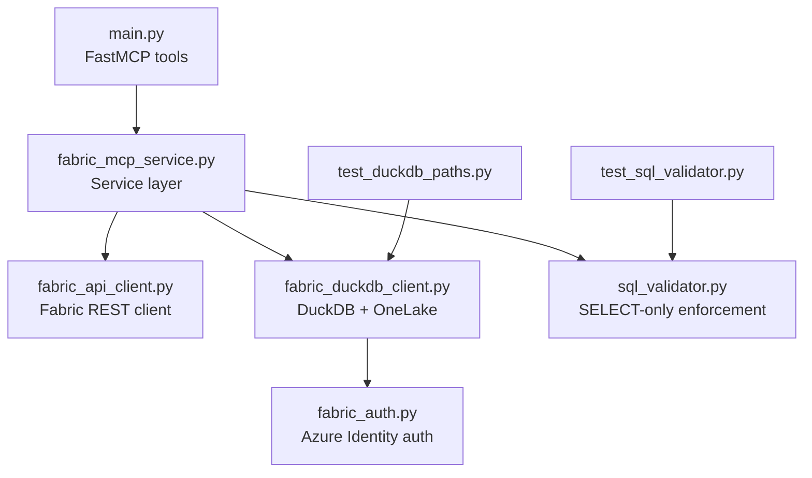
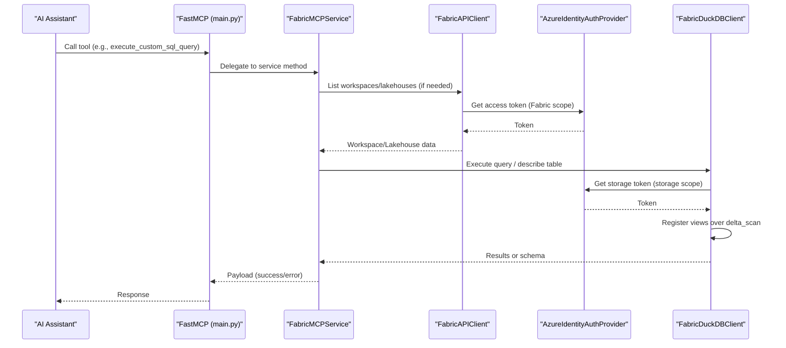
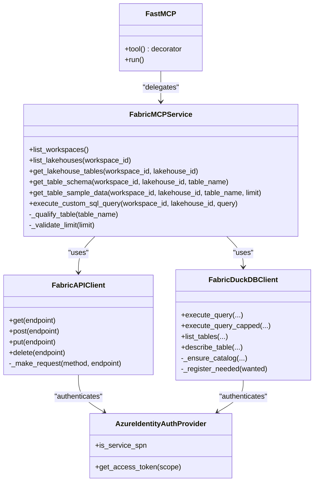
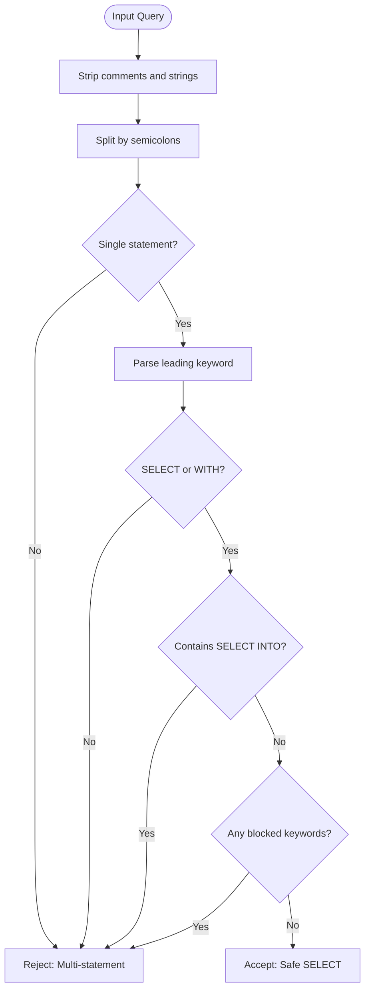
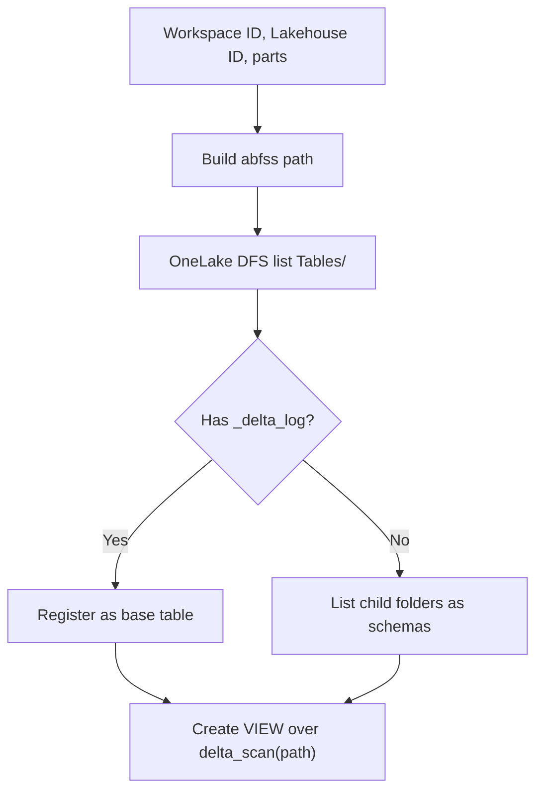
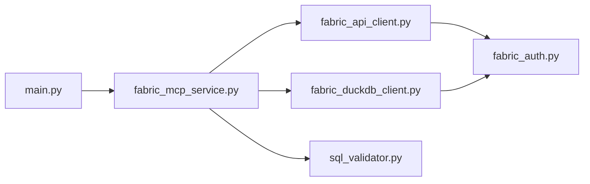

# Development Guide

<cite>
**Referenced Files in This Document**
- [README.md](file://README.md)
- [CONTRIBUTING.md](file://CONTRIBUTING.md)
- [PLAN.md](file://PLAN.md)
- [main.py](file://main.py)
- [fabric_mcp_service.py](file://fabric_mcp_service.py)
- [fabric_api_client.py](file://fabric_api_client.py)
- [fabric_auth.py](file://fabric_auth.py)
- [fabric_duckdb_client.py](file://fabric_duckdb_client.py)
- [sql_validator.py](file://sql_validator.py)
- [test_sql_validator.py](file://test_sql_validator.py)
- [test_duckdb_paths.py](file://test_duckdb_paths.py)
- [requirements.txt](file://requirements.txt)
</cite>

## Table of Contents
1. [Introduction](#introduction)
2. [Project Structure](#project-structure)
3. [Core Components](#core-components)
4. [Architecture Overview](#architecture-overview)
5. [Detailed Component Analysis](#detailed-component-analysis)
6. [Dependency Analysis](#dependency-analysis)
7. [Performance Considerations](#performance-considerations)
8. [Troubleshooting Guide](#troubleshooting-guide)
9. [Conclusion](#conclusion)
10. [Appendices](#appendices)

## Introduction
This guide explains how to contribute to the Fabric MCP Server, a Model Context Protocol (MCP) server that exposes tools for exploring Microsoft Fabric lakehouses. It covers environment setup, coding standards, testing strategies, adding new tools via the @mcp.tool() decorator pattern, debugging and logging best practices, performance profiling, contribution workflow, code review process, release procedures, extension points, plugin patterns, and integration testing approaches. The project uses FastMCP for tool exposure, Azure Identity for authentication, a REST client for Fabric APIs, and DuckDB with delta_scan over OneLake Delta tables for read-only SQL queries.

## Project Structure
The repository is organized into a small set of focused modules:
- Entry point and tool definitions: main.py
- Service layer orchestrating business logic: fabric_mcp_service.py
- Authentication provider: fabric_auth.py
- Fabric REST API client: fabric_api_client.py
- DuckDB client for OneLake Delta reads: fabric_duckdb_client.py
- SQL validator enforcing SELECT-only: sql_validator.py
- Tests for SQL validation and DuckDB path helpers: test_sql_validator.py, test_duckdb_paths.py
- Documentation and planning: README.md, CONTRIBUTING.md, PLAN.md, docs/*
- Dependencies: requirements.txt

**Diagram sources**
- [main.py:1-152](file://main.py#L1-L152)
- [fabric_mcp_service.py:1-153](file://fabric_mcp_service.py#L1-L153)
- [fabric_api_client.py:1-59](file://fabric_api_client.py#L1-L59)
- [fabric_auth.py:1-64](file://fabric_auth.py#L1-L64)
- [fabric_duckdb_client.py:1-438](file://fabric_duckdb_client.py#L1-L438)
- [sql_validator.py:1-124](file://sql_validator.py#L1-L124)
- [test_sql_validator.py:1-41](file://test_sql_validator.py#L1-L41)
- [test_duckdb_paths.py:1-66](file://test_duckdb_paths.py#L1-L66)

**Section sources**
- [README.md:1-257](file://README.md#L1-L257)
- [CONTRIBUTING.md:1-152](file://CONTRIBUTING.md#L1-L152)
- [PLAN.md:1-73](file://PLAN.md#L1-L73)

## Core Components
- FastMCP entrypoint and tools: Exposes MCP tools using @mcp.tool(), delegating to service methods.
- Service layer: Validates inputs, qualifies table names, enforces limits, composes calls to REST and DuckDB clients, and returns consistent payloads.
- Auth provider: Mints tokens via Azure CLI or service principal; supports scopes for Fabric API and storage.
- REST client: Paginates responses from Fabric REST API endpoints.
- DuckDB client: Discovers tables via OneLake DFS listing, registers lazy views over delta_scan, executes queries with row caps, and describes schemas.
- SQL validator: Enforces SELECT-only queries, rejecting writes, DDL, multi-statement batches, and dangerous keywords.

Key responsibilities by module:
- main.py: Tool registration and FastMCP lifecycle.
- fabric_mcp_service.py: Business logic, input validation, error handling, and orchestration.
- fabric_api_client.py: HTTP requests to Fabric REST API with token injection and pagination.
- fabric_auth.py: Token acquisition for both Fabric API and storage scopes.
- fabric_duckdb_client.py: DuckDB connection management, secret refresh, table discovery, view registration, query execution, schema description.
- sql_validator.py: Static analysis to ensure safe, read-only SQL.

**Section sources**
- [main.py:19-152](file://main.py#L19-L152)
- [fabric_mcp_service.py:14-153](file://fabric_mcp_service.py#L14-L153)
- [fabric_api_client.py:13-59](file://fabric_api_client.py#L13-L59)
- [fabric_auth.py:14-64](file://fabric_auth.py#L14-L64)
- [fabric_duckdb_client.py:124-438](file://fabric_duckdb_client.py#L124-L438)
- [sql_validator.py:80-105](file://sql_validator.py#L80-L105)

## Architecture Overview
The runtime flow connects an AI assistant through MCP tools to Fabric resources and OneLake data:

**Diagram sources**
- [main.py:35-143](file://main.py#L35-L143)
- [fabric_mcp_service.py:56-153](file://fabric_mcp_service.py#L56-L153)
- [fabric_api_client.py:21-49](file://fabric_api_client.py#L21-L49)
- [fabric_auth.py:34-42](file://fabric_auth.py#L34-L42)
- [fabric_duckdb_client.py:135-162](file://fabric_duckdb_client.py#L135-L162)
- [fabric_duckdb_client.py:369-392](file://fabric_duckdb_client.py#L369-L392)

## Detailed Component Analysis

### MCP Tools and Decorator Pattern
Tools are defined in main.py using the @mcp.tool() decorator. Each tool delegates to a corresponding method in FabricMCPService, ensuring separation of concerns between transport (MCP) and business logic (service).

**Diagram sources**
- [main.py:35-143](file://main.py#L35-L143)
- [fabric_mcp_service.py:14-153](file://fabric_mcp_service.py#L14-L153)
- [fabric_api_client.py:13-59](file://fabric_api_client.py#L13-L59)
- [fabric_duckdb_client.py:124-438](file://fabric_duckdb_client.py#L124-L438)
- [fabric_auth.py:14-64](file://fabric_auth.py#L14-L64)

**Section sources**
- [main.py:35-143](file://main.py#L35-L143)

### Adding New MCP Tools
To add a new tool:
1. Define an async function in main.py decorated with @mcp.tool().
2. Add clear docstrings describing parameters and return values.
3. Delegate to a method in FabricMCPService for business logic.
4. Update README.md with tool usage examples and behavior.
5. Add tests if the tool introduces new logic or edge cases.

Example structure reference:
- Tool definition and delegation: [main.py:35-143](file://main.py#L35-L143)
- Service method implementation: [fabric_mcp_service.py:56-153](file://fabric_mcp_service.py#L56-L153)

**Section sources**
- [main.py:35-143](file://main.py#L35-L143)
- [fabric_mcp_service.py:56-153](file://fabric_mcp_service.py#L56-L153)
- [README.md:207-225](file://README.md#L207-L225)
- [CONTRIBUTING.md:90-123](file://CONTRIBUTING.md#L90-L123)

### SQL Validation and DuckDB Path Handling
SQL validation ensures only SELECT or WITH…SELECT statements run, blocking writes, DDL, and dangerous operations. DuckDB path handling constructs abfss paths using GUIDs and discovers tables via OneLake DFS listing.

**Diagram sources**
- [sql_validator.py:47-105](file://sql_validator.py#L47-L105)

DuckDB path helper flow:

**Diagram sources**
- [fabric_duckdb_client.py:76-82](file://fabric_duckdb_client.py#L76-L82)
- [fabric_duckdb_client.py:227-256](file://fabric_duckdb_client.py#L227-L256)
- [fabric_duckdb_client.py:280-297](file://fabric_duckdb_client.py#L280-L297)

**Section sources**
- [sql_validator.py:80-105](file://sql_validator.py#L80-L105)
- [fabric_duckdb_client.py:76-82](file://fabric_duckdb_client.py#L76-L82)
- [fabric_duckdb_client.py:227-256](file://fabric_duckdb_client.py#L227-L256)
- [fabric_duckdb_client.py:280-297](file://fabric_duckdb_client.py#L280-L297)

### Testing Framework and Strategies
- Unit tests for SQL validation: test_sql_validator.py validates allowed and rejected queries.
- Unit tests for DuckDB path helpers: test_duckdb_paths.py verifies path construction, directory parsing, and table reference extraction without network calls.
- Run tests locally using Python’s built-in test runner or pytest if configured.

Recommended strategy:
- Keep unit tests isolated and deterministic where possible.
- For integration tests involving Fabric REST and OneLake, use environment variables and credentials securely.
- Mock external dependencies when testing service-layer logic in isolation.

**Section sources**
- [test_sql_validator.py:1-41](file://test_sql_validator.py#L1-L41)
- [test_duckdb_paths.py:1-66](file://test_duckdb_paths.py#L1-L66)

### Debugging Common Issues
Common issues and resolutions:
- Token acquisition fails: Ensure az login targets the correct tenant; verify workspace permissions.
- DuckDB/OneLake read fails: Confirm extensions download, use GUIDs for paths, retry transient errors.
- Tools not appearing: Verify MCP command points to .venv/bin/python and restart after dependency changes.

Logging best practices:
- Log at appropriate levels (info for normal flows, warning for recoverable issues, error for failures).
- Include context such as workspace_id, lakehouse_id, and table references in logs.
- Avoid logging secrets or sensitive tokens.

Performance profiling:
- Profile slow queries using DuckDB’s EXPLAIN (when allowed by policy) or measure end-to-end latency in service methods.
- Monitor network calls to OneLake DFS and Fabric REST API.
- Use row caps to prevent large result sets; enforce LIMIT in custom SQL where appropriate.

**Section sources**
- [README.md:234-249](file://README.md#L234-L249)
- [fabric_api_client.py:21-49](file://fabric_api_client.py#L21-L49)
- [fabric_duckdb_client.py:163-209](file://fabric_duckdb_client.py#L163-L209)

### Contribution Workflow and Code Review
Workflow:
- Fork the repository and create a feature branch from main.
- Implement changes following PEP 8 and project conventions.
- Add or update tests and documentation.
- Submit a pull request with a clear description and related issue references.

Code review guidelines:
- Focus on single features or fixes per PR.
- Ensure tests pass and documentation is updated.
- Follow existing style and type hints.

Release procedures:
- Validate all tools and integrations before release.
- Update README.md with new tool descriptions and usage.
- Tag releases and publish notes summarizing changes.

**Section sources**
- [CONTRIBUTING.md:19-33](file://CONTRIBUTING.md#L19-L33)
- [CONTRIBUTING.md:35-63](file://CONTRIBUTING.md#L35-L63)
- [CONTRIBUTING.md:90-123](file://CONTRIBUTING.md#L90-L123)
- [README.md:250-252](file://README.md#L250-L252)

### Extension Points and Plugin Patterns
Extension points:
- New MCP tools: Add @mcp.tool() functions in main.py and delegate to service methods.
- Custom SQL transformations: Extend sql_validator or preprocess queries in service layer.
- Additional data sources: Integrate new clients similar to FabricAPIClient or FabricDuckDBClient.

Plugin development patterns:
- Encapsulate external interactions behind interfaces (e.g., auth providers, REST clients).
- Use dependency injection in service layer to swap implementations.
- Provide configuration via environment variables and validate early.

Integration testing approaches:
- Test against live Fabric and OneLake with minimal datasets.
- Use fixtures for workspace and lakehouse IDs.
- Isolate network-dependent tests and mark them appropriately.

**Section sources**
- [main.py:35-143](file://main.py#L35-L143)
- [fabric_mcp_service.py:14-153](file://fabric_mcp_service.py#L14-L153)
- [fabric_api_client.py:13-59](file://fabric_api_client.py#L13-L59)
- [fabric_duckdb_client.py:124-438](file://fabric_duckdb_client.py#L124-L438)

## Dependency Analysis
High-level dependencies:
- main.py depends on FastMCP and FabricMCPService.
- FabricMCPService depends on FabricAPIClient, FabricDuckDBClient, and sql_validator.
- FabricAPIClient depends on AzureIdentityAuthProvider and httpx.
- FabricDuckDBClient depends on duckdb, httpx, and AzureIdentityAuthProvider.
- Tests depend on specific modules under test.

**Diagram sources**
- [main.py:19-28](file://main.py#L19-L28)
- [fabric_mcp_service.py:6-11](file://fabric_mcp_service.py#L6-L11)
- [fabric_api_client.py:5-8](file://fabric_api_client.py#L5-L8)
- [fabric_duckdb_client.py:10-15](file://fabric_duckdb_client.py#L10-L15)
- [sql_validator.py:1-6](file://sql_validator.py#L1-L6)

**Section sources**
- [requirements.txt:1-7](file://requirements.txt#L1-L7)

## Performance Considerations
- Row caps: Custom SQL results capped at 1000 rows to avoid large payloads.
- Lazy view registration: Only register views for referenced tables to minimize overhead.
- Network efficiency: Use continuation tokens for paginated REST calls and OneLake DFS listings.
- Query optimization: Encourage LIMIT and selective WHERE clauses in custom SQL.
- Local compute: DuckDB runs locally; avoid unfiltered joins on large datasets.

[No sources needed since this section provides general guidance]

## Troubleshooting Guide
- Authentication:
  - Ensure az login targets the correct tenant.
  - For service principal, set FABRIC_CLIENT_ID, FABRIC_CLIENT_SECRET, FABRIC_TENANT_ID.
- OneLake access:
  - Confirm identity has Workspace Viewer or higher.
  - Use GUIDs for paths to avoid known OneLake list bugs.
- DuckDB extensions:
  - First run downloads azure and delta extensions; ensure network access.
- Tools visibility:
  - Verify MCP command points to .venv/bin/python and restart after pip install.

**Section sources**
- [README.md:234-249](file://README.md#L234-L249)
- [fabric_auth.py:45-64](file://fabric_auth.py#L45-L64)
- [fabric_duckdb_client.py:138-148](file://fabric_duckdb_client.py#L138-L148)

## Conclusion
The Fabric MCP Server provides a secure, efficient way to explore Microsoft Fabric lakehouses through MCP tools. By following the development guidelines, testing strategies, and contribution workflows outlined here, contributors can extend functionality, maintain quality, and integrate smoothly with AI assistants. The modular architecture enables customization and plugin development while enforcing safety through SQL validation and robust authentication.

[No sources needed since this section summarizes without analyzing specific files]

## Appendices

### Environment Setup
- Prerequisites: Python 3.12+, Azure CLI, MCP client.
- Install dependencies: Create virtual environment and install requirements.
- Authentication: az login or configure service principal via environment variables.
- Run server: python main.py or fastmcp dev main:mcp for interactive mode.

**Section sources**
- [README.md:7-39](file://README.md#L7-L39)
- [requirements.txt:1-7](file://requirements.txt#L1-L7)

### Coding Standards
- Follow PEP 8, use meaningful names, add docstrings, keep functions modular, apply type hints.
- Update README.md when adding new tools or changing behavior.

**Section sources**
- [CONTRIBUTING.md:35-63](file://CONTRIBUTING.md#L35-L63)

### Security Notes
- Never commit .env files.
- Use service principal with minimum required permissions.
- Rotate secrets regularly; consider Azure Key Vault for production.

**Section sources**
- [README.md:227-233](file://README.md#L227-L233)