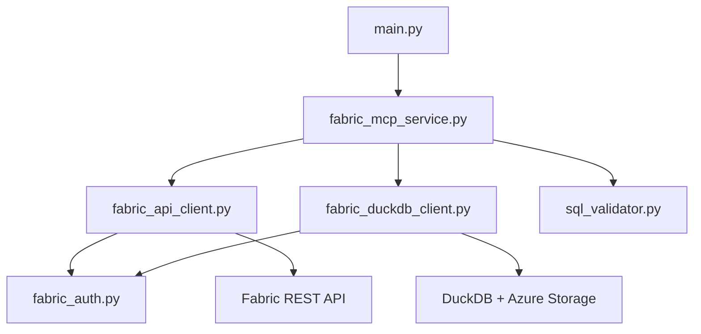
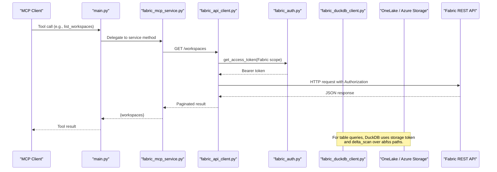
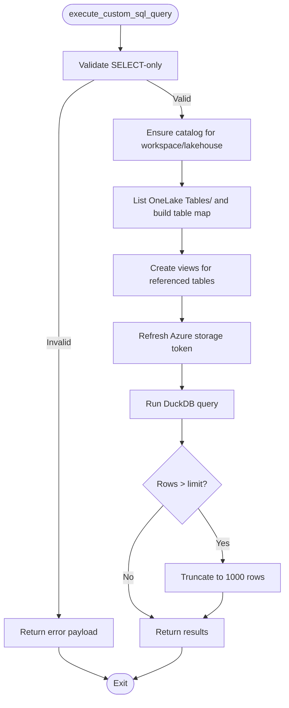
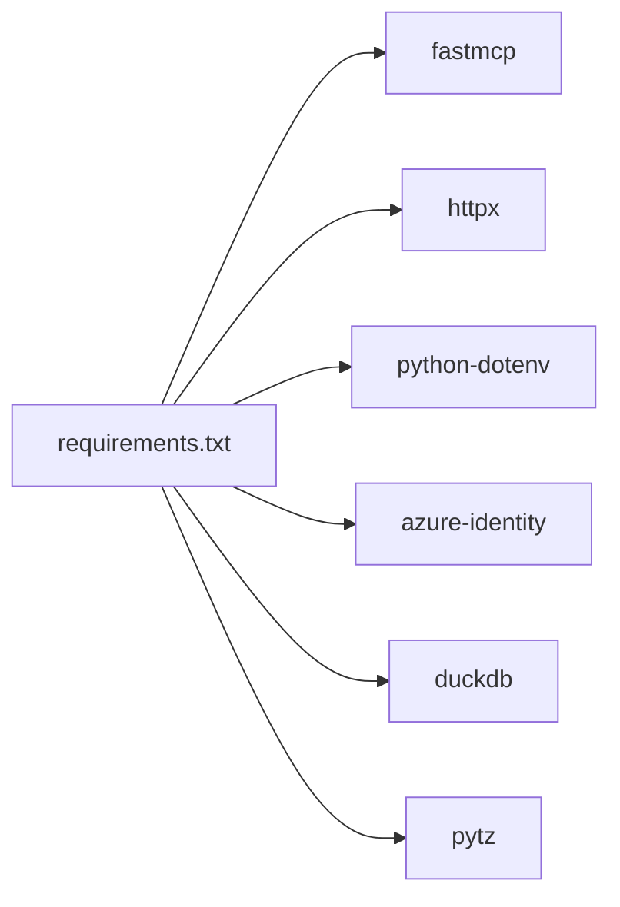

# Getting Started

<cite>
**Referenced Files in This Document**
- [README.md](file://README.md)
- [requirements.txt](file://requirements.txt)
- [main.py](file://main.py)
- [fabric_mcp_service.py](file://fabric_mcp_service.py)
- [fabric_auth.py](file://fabric_auth.py)
- [fabric_api_client.py](file://fabric_api_client.py)
- [fabric_duckdb_client.py](file://fabric_duckdb_client.py)
- [sql_validator.py](file://sql_validator.py)
- [PLAN.md](file://PLAN.md)
</cite>

## Table of Contents
1. Introduction
2. Project Structure
3. Core Components
4. Architecture Overview
5. Detailed Component Analysis
6. Dependency Analysis
7. Performance Considerations
8. Troubleshooting Guide
9. Conclusion

## Introduction
This guide helps you quickly set up and run the Fabric MCP Server to explore Microsoft Fabric workspaces and lakehouses using an MCP client. You will install dependencies, configure authentication (interactive via Azure CLI or service principal), and run the server in stdio mode for VS Code or development mode with FastMCP. The server exposes tools to list workspaces and lakehouses, enumerate tables, inspect schemas, sample data, and run SELECT-only SQL against OneLake Delta tables using DuckDB.

## Project Structure
The project is organized around a small set of focused modules:
- Entry point and tool definitions: main.py
- Service layer coordinating API and SQL clients: fabric_mcp_service.py
- Authentication abstraction over azure-identity: fabric_auth.py
- Fabric REST client with pagination: fabric_api_client.py
- DuckDB client that reads OneLake Delta via storage tokens: fabric_duckdb_client.py
- SQL validator enforcing SELECT-only queries: sql_validator.py
- Requirements and documentation: requirements.txt, README.md, PLAN.md

**Diagram sources**
- [main.py:20-28](file://main.py#L20-L28)
- [fabric_mcp_service.py:14-19](file://fabric_mcp_service.py#L14-L19)
- [fabric_api_client.py:13-19](file://fabric_api_client.py#L13-L19)
- [fabric_duckdb_client.py:124-137](file://fabric_duckdb_client.py#L124-L137)
- [fabric_auth.py:14-63](file://fabric_auth.py#L14-L63)

**Section sources**
- [README.md:1-39](file://README.md#L1-L39)
- [requirements.txt:1-7](file://requirements.txt#L1-L7)
- [PLAN.md:25-39](file://PLAN.md#L25-L39)

## Core Components
- MCP entrypoint and tools: main.py registers tools that delegate to the service layer.
- Service layer: fabric_mcp_service.py orchestrates calls to Fabric REST and DuckDB clients, validates inputs, and formats results.
- Authentication: fabric_auth.py provides a unified token provider supporting interactive login (Azure CLI) and service principal via environment variables.
- Fabric REST client: fabric_api_client.py handles authenticated requests and continuation-token pagination.
- DuckDB client: fabric_duckdb_client.py discovers tables via OneLake DFS, creates temporary views over delta_scan, and executes queries with a storage access token.
- SQL validation: sql_validator.py enforces SELECT-only execution.

Key setup and usage references:
- Prerequisites and quick start commands are documented in the project README.
- Development and interactive modes are described in the README.
- Environment variables for service principal authentication are defined in the auth module.

**Section sources**
- [main.py:35-143](file://main.py#L35-L143)
- [fabric_mcp_service.py:14-153](file://fabric_mcp_service.py#L14-L153)
- [fabric_auth.py:45-63](file://fabric_auth.py#L45-L63)
- [fabric_api_client.py:21-49](file://fabric_api_client.py#L21-L49)
- [fabric_duckdb_client.py:138-162](file://fabric_duckdb_client.py#L138-L162)
- [sql_validator.py:80-105](file://sql_validator.py#L80-L105)
- [README.md:7-39](file://README.md#L7-L39)

## Architecture Overview
The server runs as an MCP process communicating over stdio with your editor or MCP client. Tools call into the service layer, which uses:
- FabricAPIClient to list workspaces/lakehouses via the Fabric REST API.
- FabricDuckDBClient to discover and query OneLake Delta tables through DuckDB with Azure storage tokens.

**Diagram sources**
- [main.py:35-44](file://main.py#L35-L44)
- [fabric_mcp_service.py:56-59](file://fabric_mcp_service.py#L56-L59)
- [fabric_api_client.py:21-49](file://fabric_api_client.py#L21-L49)
- [fabric_auth.py:34-42](file://fabric_auth.py#L34-L42)
- [fabric_duckdb_client.py:135-162](file://fabric_duckdb_client.py#L135-L162)

## Detailed Component Analysis

### Installation and Environment Setup
- Create and activate a Python virtual environment.
- Install dependencies from requirements.txt.
- Ensure Python 3.12+ is available.

References:
- Virtual environment and dependency installation steps are provided in the README.
- Dependencies include FastMCP, httpx, python-dotenv, azure-identity, duckdb, pytz.

**Section sources**
- [README.md:13-22](file://README.md#L13-L22)
- [requirements.txt:1-7](file://requirements.txt#L1-L7)

### Authentication Configuration
Two supported methods:

1) Interactive authentication (Azure CLI)
- Log in with Azure CLI on the same tenant as your Fabric resources.
- The server uses DefaultAzureCredential (with interactive browser excluded) to obtain tokens for both Fabric REST and Azure Storage scopes.

2) Service principal authentication
- Copy the example environment file to .env and set:
  - FABRIC_CLIENT_ID
  - FABRIC_CLIENT_SECRET
  - FABRIC_TENANT_ID
- When FABRIC_CLIENT_SECRET is present, the server uses ClientSecretCredential for non-interactive operation.

Token scopes used:
- Fabric REST: https://api.fabric.microsoft.com/.default
- Azure Storage (OneLake): https://storage.azure.com/.default

References:
- Service principal environment variables are read by the auth module.
- Scope constants are defined in the REST and DuckDB clients.
- The plan documents how az login mints tokens for both scopes.

**Section sources**
- [README.md:22-23](file://README.md#L22-L23)
- [fabric_auth.py:45-63](file://fabric_auth.py#L45-L63)
- [fabric_api_client.py:9-10](file://fabric_api_client.py#L9-L10)
- [fabric_duckdb_client.py:17-18](file://fabric_duckdb_client.py#L17-L18)
- [PLAN.md:31-39](file://PLAN.md#L31-L39)

### Running the Server
- Stdio transport (recommended for VS Code):
  - Run the entry script directly; it starts the FastMCP server over stdio.
- Development/interactive mode:
  - Use the FastMCP CLI to launch an interactive session for testing tools.

References:
- README lists both run commands and notes stdio transport for VS Code.

**Section sources**
- [README.md:24-39](file://README.md#L24-L39)
- [main.py:150-152](file://main.py#L150-L152)

### Available Tools Overview
The server exposes tools to:
- List workspaces and lakehouses
- Enumerate tables in a lakehouse
- Get table schema details
- Sample rows from a table
- Execute custom SELECT queries (capped at 1000 rows)

These tools are registered in the entrypoint and implemented in the service layer.

**Section sources**
- [main.py:35-143](file://main.py#L35-L143)
- [README.md:41-143](file://README.md#L41-L143)

### Data Flow for Query Execution
When running a custom SQL query:
- The service validates the query is SELECT-only.
- The DuckDB client ensures a catalog exists for the workspace/lakehouse by listing OneLake Tables/ and creating views only for referenced tables.
- A storage access token is refreshed per query and injected into DuckDB via a secret.
- Results are returned with truncation metadata if the row cap is hit.

**Diagram sources**
- [fabric_mcp_service.py:125-152](file://fabric_mcp_service.py#L125-L152)
- [fabric_duckdb_client.py:227-256](file://fabric_duckdb_client.py#L227-L256)
- [fabric_duckdb_client.py:335-353](file://fabric_duckdb_client.py#L335-L353)
- [sql_validator.py:80-105](file://sql_validator.py#L80-L105)

## Dependency Analysis
High-level runtime dependencies:
- fastmcp: MCP server framework and CLI
- httpx: Async HTTP client for REST and OneLake DFS
- python-dotenv: Load environment variables for service principal
- azure-identity: Token acquisition for Azure CLI and service principal flows
- duckdb: Local query engine with Azure and Delta extensions
- pytz: Timezone utilities (if needed by downstream logic)

**Diagram sources**
- [requirements.txt:1-7](file://requirements.txt#L1-L7)

**Section sources**
- [requirements.txt:1-7](file://requirements.txt#L1-L7)

## Performance Considerations
- Queries run locally in DuckDB; large joins can pull significant Parquet data over the network.
- Custom SELECT results are capped at 1000 rows to avoid large payloads.
- Table discovery avoids scanning every table; views are created lazily for referenced tables only.
- Storage tokens are refreshed per query to handle short-lived credentials.

[No sources needed since this section provides general guidance]

## Troubleshooting Guide
Common issues and resolutions:

- Token acquisition fails
  - Confirm your Azure CLI account is logged into the correct tenant.
  - Re-run login with the target tenant if necessary.
  - Ensure the identity has Workspace Viewer (or higher) permissions.

- DuckDB or OneLake read failures
  - First run downloads required DuckDB extensions; ensure outbound network access.
  - Use workspace and lakehouse GUIDs from the list tools, not display names.
  - If encountering transient OneLake listing errors, retry; GUID-based paths mitigate known issues.

- Tools not appearing in your MCP client
  - Ensure the MCP command points to the Python executable inside your virtual environment.
  - Restart the MCP server after installing or updating dependencies.

- SELECT-only enforcement
  - Only single SELECT or WITH…SELECT statements are allowed; writes, DDL, and multi-statement batches are rejected.

- Service principal configuration
  - When using FABRIC_CLIENT_SECRET, also set FABRIC_CLIENT_ID and FABRIC_TENANT_ID.
  - Keep secrets out of version control and rotate regularly.

**Section sources**
- [README.md:227-249](file://README.md#L227-L249)
- [fabric_auth.py:45-63](file://fabric_auth.py#L45-L63)
- [fabric_api_client.py:21-31](file://fabric_api_client.py#L21-L31)
- [fabric_duckdb_client.py:163-209](file://fabric_duckdb_client.py#L163-L209)
- [sql_validator.py:80-105](file://sql_validator.py#L80-L105)

## Conclusion
You now have the prerequisites, environment setup, authentication options, and run instructions to operate the Fabric MCP Server. Use stdio mode for VS Code integration or the FastMCP CLI for interactive development. The server provides safe, efficient access to Fabric workspaces and OneLake Delta tables through curated tools and SELECT-only SQL execution. Refer to the troubleshooting section if you encounter authentication or connectivity issues during setup.