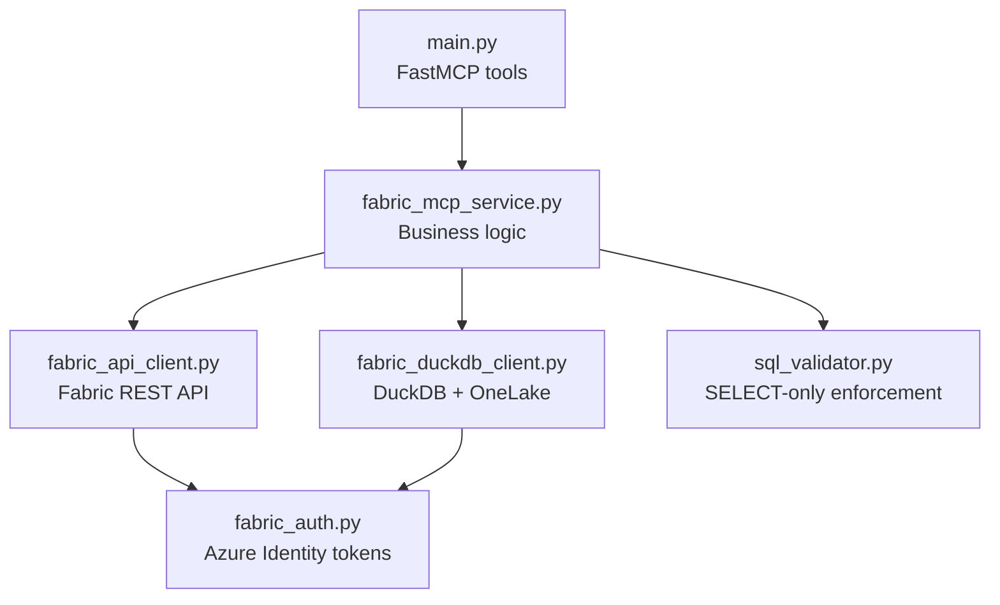
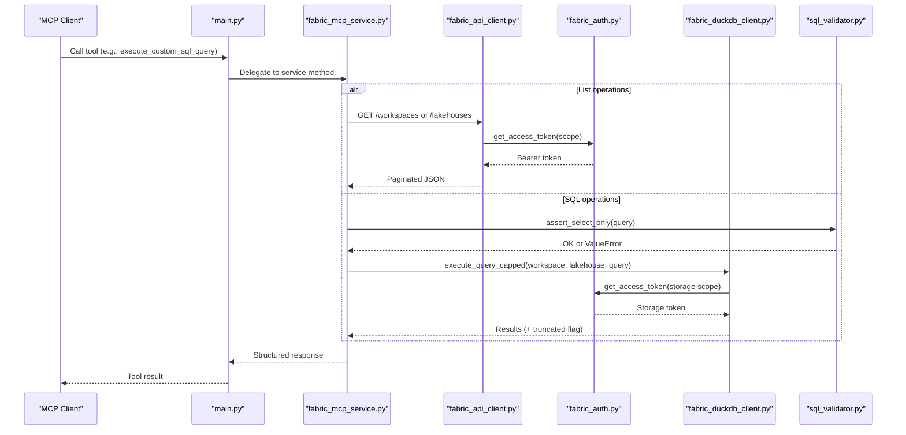
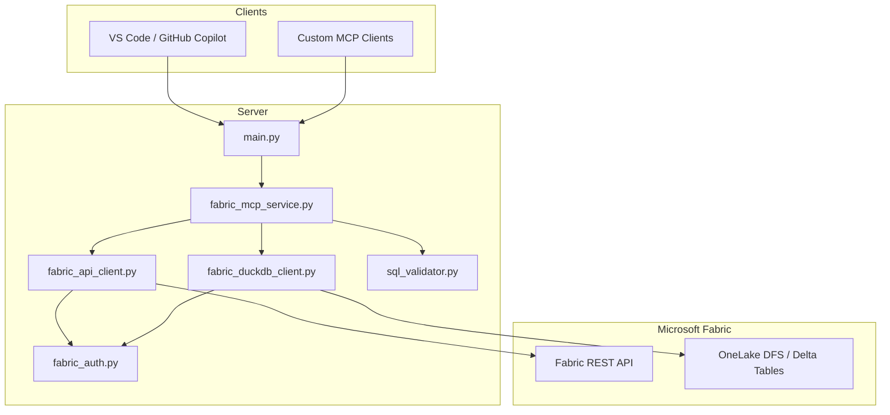
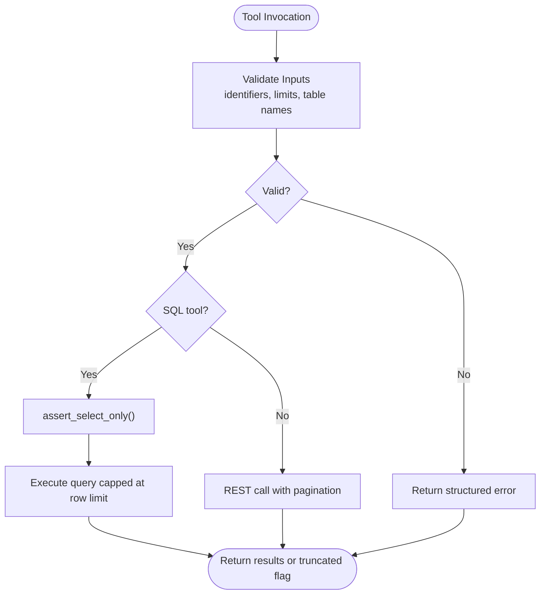
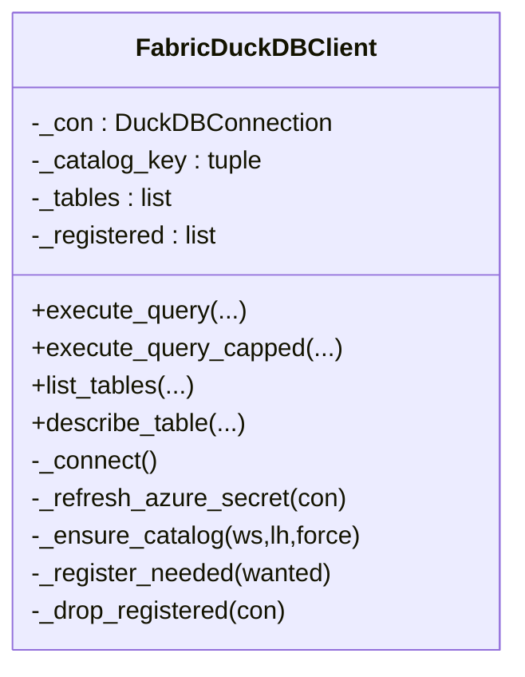
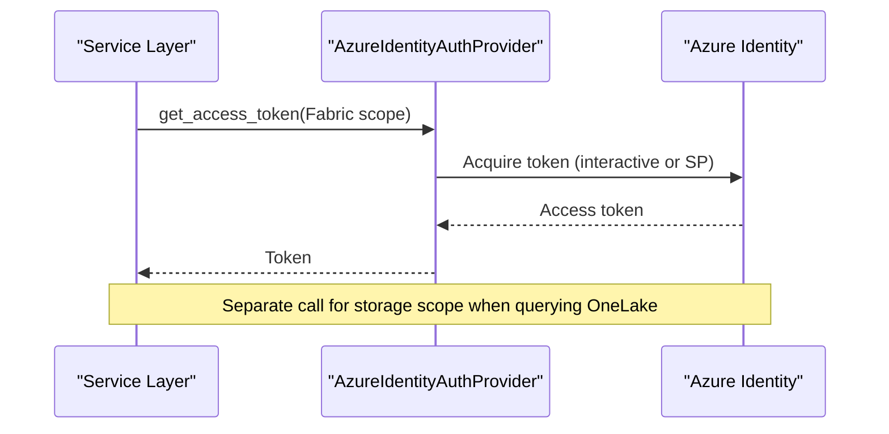
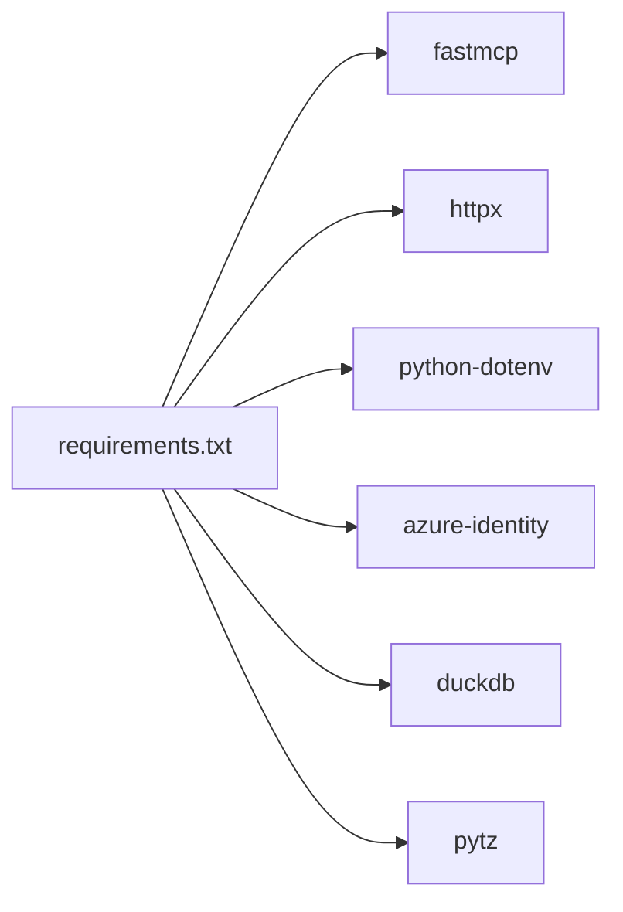

# Integration Examples

<cite>
**Referenced Files in This Document**
- [README.md](file://README.md)
- [main.py](file://main.py)
- [fabric_mcp_service.py](file://fabric_mcp_service.py)
- [fabric_api_client.py](file://fabric_api_client.py)
- [fabric_duckdb_client.py](file://fabric_duckdb_client.py)
- [fabric_auth.py](file://fabric_auth.py)
- [sql_validator.py](file://sql_validator.py)
- [requirements.txt](file://requirements.txt)
- [docs/1-building-mcp-server-with-fastmcp.md](file://docs/1-building-mcp-server-with-fastmcp.md)
- [docs/2-microsoft-fabric-integration.md](file://docs/2-microsoft-fabric-integration.md)
- [docs/3-dual-authentication-system.md](file://docs/3-dual-authentication-system.md)
- [test_duckdb_paths.py](file://test_duckdb_paths.py)
</cite>

## Table of Contents
1. Introduction
2. Project Structure
3. Core Components
4. Architecture Overview
5. Detailed Component Analysis
6. Dependency Analysis
7. Performance Considerations
8. Troubleshooting Guide
9. Conclusion
10. Appendices

## Introduction
This document provides practical integration examples for the Fabric MCP Server with various MCP clients, including GitHub Copilot via VS Code. It covers setup using mcp.json and manual VS Code settings, custom client development patterns, environment configuration, testing strategies, error handling best practices, connection management, resource cleanup, security considerations, and performance optimization tips.

## Project Structure
The project is a FastMCP-based server that exposes tools to explore Microsoft Fabric workspaces and lakehouses and run read-only SQL queries against OneLake Delta tables using DuckDB. The entry point registers tools and runs the server; business logic is encapsulated in a service layer; REST and SQL access are abstracted into dedicated clients; authentication is provided by an Azure Identity wrapper; and SQL safety is enforced by a validator.

**Diagram sources**
- [main.py:24-152](file://main.py#L24-L152)
- [fabric_mcp_service.py:14-153](file://fabric_mcp_service.py#L14-L153)
- [fabric_api_client.py:13-59](file://fabric_api_client.py#L13-L59)
- [fabric_duckdb_client.py:124-438](file://fabric_duckdb_client.py#L124-L438)
- [fabric_auth.py:14-64](file://fabric_auth.py#L14-L64)
- [sql_validator.py:80-105](file://sql_validator.py#L80-L105)

**Section sources**
- [README.md:1-40](file://README.md#L1-L40)
- [main.py:1-152](file://main.py#L1-L152)
- [requirements.txt:1-7](file://requirements.txt#L1-L7)

## Core Components
- MCP Tools: Exposed via FastMCP decorators in the entrypoint, each tool delegates to the service layer.
- Service Layer: Validates inputs, composes calls to REST and SQL clients, and returns consistent payloads.
- REST Client: Async HTTP client for Fabric APIs with automatic pagination and bearer token injection.
- SQL Client: Manages DuckDB connections, installs/loads extensions, refreshes storage secrets, discovers tables via OneLake DFS, registers views, and executes queries safely.
- Authentication: Provides tokens via DefaultAzureCredential or ClientSecretCredential based on environment variables.
- SQL Validator: Enforces SELECT-only queries and blocks dangerous keywords.

Key responsibilities and interactions are illustrated below.

**Diagram sources**
- [main.py:35-143](file://main.py#L35-L143)
- [fabric_mcp_service.py:56-153](file://fabric_mcp_service.py#L56-L153)
- [fabric_api_client.py:21-49](file://fabric_api_client.py#L21-L49)
- [fabric_auth.py:34-64](file://fabric_auth.py#L34-L64)
- [fabric_duckdb_client.py:124-438](file://fabric_duckdb_client.py#L124-L438)
- [sql_validator.py:80-105](file://sql_validator.py#L80-L105)

**Section sources**
- [main.py:24-152](file://main.py#L24-L152)
- [fabric_mcp_service.py:14-153](file://fabric_mcp_service.py#L14-L153)
- [fabric_api_client.py:1-59](file://fabric_api_client.py#L1-L59)
- [fabric_duckdb_client.py:1-438](file://fabric_duckdb_client.py#L1-L438)
- [fabric_auth.py:1-64](file://fabric_auth.py#L1-L64)
- [sql_validator.py:1-124](file://sql_validator.py#L1-L124)

## Architecture Overview
The server integrates with Microsoft Fabric through two channels:
- REST API for discovery (workspaces, lakehouses).
- SQL endpoint via DuckDB reading OneLake Delta tables using Azure storage tokens.

Authentication is unified through an Azure Identity provider that selects between interactive and service principal modes based on environment configuration.

**Diagram sources**
- [main.py:24-152](file://main.py#L24-L152)
- [fabric_mcp_service.py:14-153](file://fabric_mcp_service.py#L14-L153)
- [fabric_api_client.py:13-59](file://fabric_api_client.py#L13-L59)
- [fabric_duckdb_client.py:124-438](file://fabric_duckdb_client.py#L124-L438)
- [fabric_auth.py:14-64](file://fabric_auth.py#L14-L64)
- [sql_validator.py:80-105](file://sql_validator.py#L80-L105)

## Detailed Component Analysis

### GitHub Copilot Integration (VS Code)
Two supported methods are documented:
- Using an mcp.json file when the VS Code MCP extension is installed.
- Manual configuration via user settings to launch the server process.

Steps include enabling MCP, configuring the server command and working directory, reloading VS Code, and testing via Copilot Chat prompts.

**Section sources**
- [README.md:145-187](file://README.md#L145-L187)
- [docs/1-building-mcp-server-with-fastmcp.md:67-78](file://docs/1-building-mcp-server-with-fastmcp.md#L67-L78)

### Custom Client Development Patterns
While this repository focuses on the server side, you can build custom MCP clients in any language that supports the Model Context Protocol. General guidance includes:
- Implement stdio transport to communicate with the server process.
- Discover available tools and call them with required parameters.
- Handle structured responses and errors returned by tools.
- Manage lifecycle events such as server startup, shutdown, and reconnection.

For concrete examples, refer to the official MCP documentation for your chosen language.

[No sources needed since this section provides general guidance]

### Environment Setup and Running the Server
- Create and activate a Python virtual environment.
- Install dependencies from requirements.
- Authenticate interactively with Azure CLI or configure service principal credentials.
- Run the server via the entrypoint or use the FastMCP dev CLI for interactive testing.

**Section sources**
- [README.md:7-39](file://README.md#L7-L39)
- [requirements.txt:1-7](file://requirements.txt#L1-L7)

### Testing Integrations Locally
- Start the server in stdio mode and test tools directly.
- Use the FastMCP dev CLI to interactively invoke tools.
- Validate behavior with sample prompts in Copilot Chat.

**Section sources**
- [README.md:189-205](file://README.md#L189-L205)

### Error Handling Best Practices
- Input validation: identifiers and limits are validated before execution.
- SQL safety: only single SELECT statements are allowed; dangerous keywords are blocked.
- Graceful failures: service methods return structured error payloads rather than raising exceptions to clients.
- Network resilience: REST client handles non-200 responses; OneLake list operations provide actionable hints on permission issues.

**Diagram sources**
- [fabric_mcp_service.py:21-54](file://fabric_mcp_service.py#L21-L54)
- [fabric_mcp_service.py:75-153](file://fabric_mcp_service.py#L75-L153)
- [sql_validator.py:80-105](file://sql_validator.py#L80-L105)

**Section sources**
- [fabric_mcp_service.py:21-153](file://fabric_mcp_service.py#L21-L153)
- [sql_validator.py:1-124](file://sql_validator.py#L1-L124)
- [fabric_api_client.py:21-49](file://fabric_api_client.py#L21-L49)
- [fabric_duckdb_client.py:163-209](file://fabric_duckdb_client.py#L163-L209)

### Connection Management and Resource Cleanup
- DuckDB connection is created lazily and reused within the client instance.
- Extensions (azure, delta) are installed and loaded once per connection.
- Azure storage secret is refreshed before each operation to keep tokens current.
- Registered views are dropped and schemas cleaned up when catalog changes to avoid stale state.
- REST requests use short-lived async HTTP clients with timeouts.

**Diagram sources**
- [fabric_duckdb_client.py:124-438](file://fabric_duckdb_client.py#L124-L438)

**Section sources**
- [fabric_duckdb_client.py:135-162](file://fabric_duckdb_client.py#L135-L162)
- [fabric_duckdb_client.py:258-297](file://fabric_duckdb_client.py#L258-L297)
- [fabric_duckdb_client.py:335-392](file://fabric_duckdb_client.py#L335-L392)

### Security Considerations and Authentication Delegation
- Dual authentication:
  - Interactive mode uses device code flow and caches tokens locally.
  - Service principal mode uses client credentials flow when secrets are configured.
- Scope usage:
  - Fabric REST API uses the Fabric scope.
  - OneLake storage access uses the Azure storage scope.
- Secrets management:
  - Store credentials in environment variables or secure vaults; never commit secrets.
- Least privilege:
  - Grant minimal required permissions for service principals.
- Token lifecycle:
  - Tokens are acquired on demand and refreshed automatically where applicable.

**Diagram sources**
- [fabric_auth.py:14-64](file://fabric_auth.py#L14-L64)
- [fabric_api_client.py:18-25](file://fabric_api_client.py#L18-L25)
- [fabric_duckdb_client.py:135-162](file://fabric_duckdb_client.py#L135-L162)

**Section sources**
- [docs/3-dual-authentication-system.md:54-140](file://docs/3-dual-authentication-system.md#L54-L140)
- [fabric_auth.py:1-64](file://fabric_auth.py#L1-L64)
- [fabric_api_client.py:1-25](file://fabric_api_client.py#L1-L25)
- [fabric_duckdb_client.py:135-162](file://fabric_duckdb_client.py#L135-L162)

## Dependency Analysis
High-level runtime dependencies and their roles:
- fastmcp: MCP server framework used to expose tools.
- httpx: Async HTTP client for Fabric REST calls.
- python-dotenv: Loads environment variables for configuration.
- azure-identity: Provides Azure AD token acquisition.
- duckdb: Local engine to query OneLake Delta tables via extensions.
- pytz: Timezone utilities (if needed by downstream components).

**Diagram sources**
- [requirements.txt:1-7](file://requirements.txt#L1-L7)

**Section sources**
- [requirements.txt:1-7](file://requirements.txt#L1-L7)

## Performance Considerations
- Query caps: SQL execution is capped to a maximum number of rows to prevent large transfers.
- View registration: Only referenced tables are registered as DuckDB views to minimize overhead.
- Pagination: REST list endpoints are paginated and merged into a single response.
- Connection reuse: DuckDB connection is reused; secrets are refreshed as needed.
- Extension loading: DuckDB extensions are installed and loaded once per connection.

Practical tips:
- Prefer specific table references in SQL to reduce scanning.
- Use LIMIT in queries to control result sizes.
- Avoid unnecessary schema enumeration; discover only what you need.

**Section sources**
- [fabric_duckdb_client.py:19-21](file://fabric_duckdb_client.py#L19-L21)
- [fabric_duckdb_client.py:280-297](file://fabric_duckdb_client.py#L280-L297)
- [fabric_api_client.py:33-49](file://fabric_api_client.py#L33-L49)
- [fabric_duckdb_client.py:138-148](file://fabric_duckdb_client.py#L138-L148)

## Troubleshooting Guide
Common issues and resolutions:
- Token acquisition fails:
  - Ensure Azure CLI login tenant matches Fabric tenant.
  - Verify workspace permissions (Workspace Viewer or higher).
- DuckDB / OneLake read fails:
  - Confirm network access for downloading DuckDB extensions.
  - Use GUIDs for workspace and lakehouse identifiers.
  - Retry transient OneLake listing errors.
- Tools not appearing:
  - Verify MCP command points to the correct Python executable in the virtual environment.
  - Restart the MCP server after dependency updates.

Additional diagnostics:
- Inspect OneLake list responses and continuation tokens for pagination issues.
- Validate SQL input to ensure it passes the SELECT-only check.

**Section sources**
- [README.md:227-249](file://README.md#L227-L249)
- [fabric_api_client.py:21-49](file://fabric_api_client.py#L21-L49)
- [fabric_duckdb_client.py:163-209](file://fabric_duckdb_client.py#L163-L209)
- [sql_validator.py:80-105](file://sql_validator.py#L80-L105)

## Conclusion
The Fabric MCP Server provides a robust foundation for integrating AI assistants with Microsoft Fabric. By combining FastMCP tools, a clear service layer, secure authentication, and safe SQL execution, it enables seamless data discovery and analytics workflows. Follow the integration guides for GitHub Copilot and consider the best practices for building custom clients, managing connections, and securing credentials.

## Appendices

### Appendix A: Endpoints and Tools Summary
- list_workspaces(): Lists accessible Fabric workspaces.
- list_lakehouses(workspace_id): Lists lakehouses in a workspace.
- get_lakehouse_tables(workspace_id, lakehouse_id): Enumerates tables in a lakehouse.
- get_table_schema(workspace_id, lakehouse_id, table_name): Retrieves column metadata.
- get_table_sample_data(workspace_id, lakehouse_id, table_name, limit): Samples rows from a table.
- execute_custom_sql_query(workspace_id, lakehouse_id, query): Runs a SELECT-only query with row cap.

**Section sources**
- [README.md:41-143](file://README.md#L41-L143)
- [main.py:35-143](file://main.py#L35-L143)

### Appendix B: Unit Tests for Path Helpers
- Tests validate path helpers, directory detection, and SQL reference parsing without network calls.

**Section sources**
- [test_duckdb_paths.py:1-66](file://test_duckdb_paths.py#L1-L66)