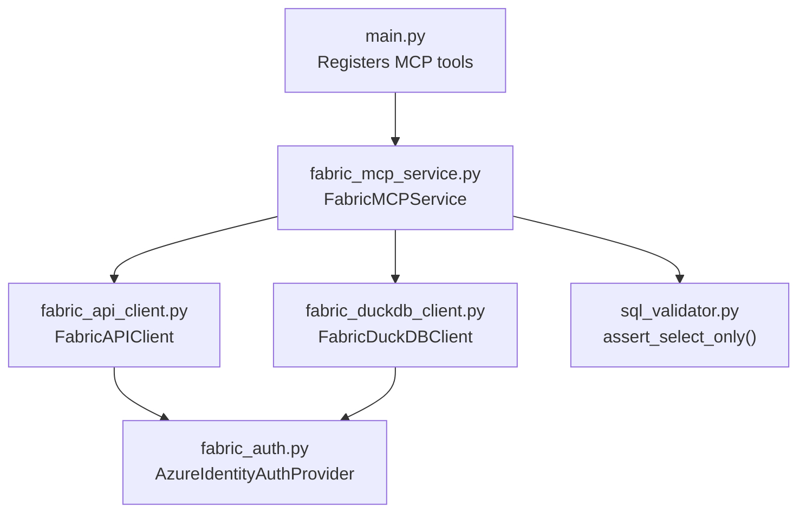
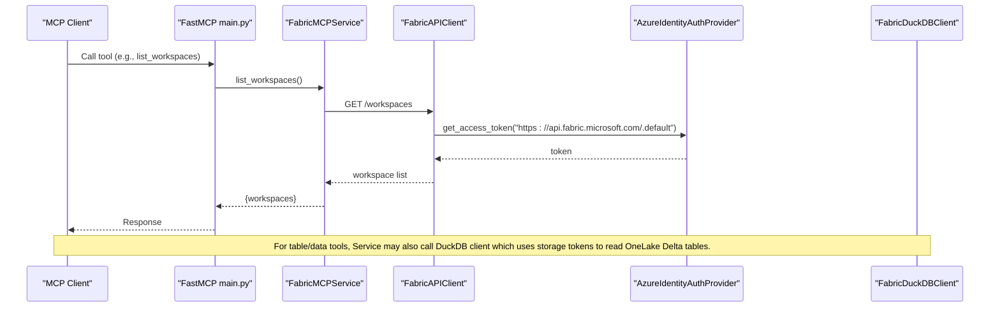
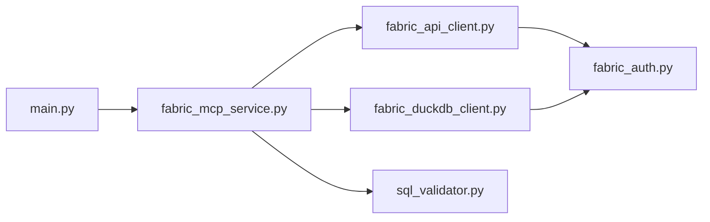
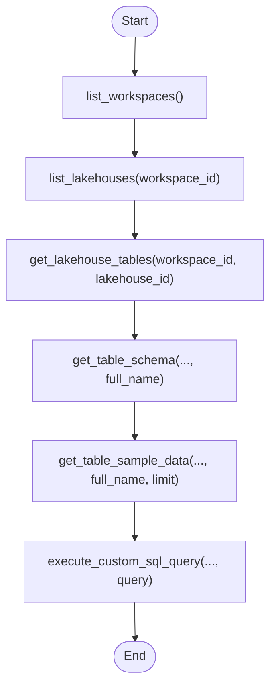

# MCP Tools Reference

<cite>
**Referenced Files in This Document**
- [main.py](file://main.py)
- [fabric_mcp_service.py](file://fabric_mcp_service.py)
- [fabric_api_client.py](file://fabric_api_client.py)
- [fabric_duckdb_client.py](file://fabric_duckdb_client.py)
- [fabric_auth.py](file://fabric_auth.py)
- [sql_validator.py](file://sql_validator.py)
- [README.md](file://README.md)
- [requirements.txt](file://requirements.txt)
</cite>

## Table of Contents
1. [Introduction](#introduction)
2. [Project Structure](#project-structure)
3. [Core Components](#core-components)
4. [Architecture Overview](#architecture-overview)
5. [Detailed Component Analysis](#detailed-component-analysis)
6. [Dependency Analysis](#dependency-analysis)
7. [Performance Considerations](#performance-considerations)
8. [Troubleshooting Guide](#troubleshooting-guide)
9. [Conclusion](#conclusion)
10. [Appendices](#appendices)

## Introduction
This document provides comprehensive API documentation for all MCP tools exposed by the Fabric MCP Server. The server exposes six tools to explore Microsoft Fabric workspaces and lakehouses, list tables, inspect schemas, sample data, and run read-only DuckDB SQL against OneLake Delta tables. It is designed for AI assistants and clients that use the Model Context Protocol (MCP).

Key capabilities:
- Discover workspaces and lakehouses via the Fabric REST API
- Enumerate tables in a lakehouse
- Inspect table schema metadata
- Sample rows from tables
- Execute SELECT-only DuckDB queries with safety checks and result caps

Authentication supports Azure CLI or service principal, and data access uses DuckDB with Azure storage tokens to read OneLake Delta tables.

**Section sources**
- [main.py:1-17](file://main.py#L1-L17)
- [README.md:1-6](file://README.md#L1-L6)

## Project Structure
The project is organized around a FastMCP entry point that registers tools, a service layer implementing business logic, and specialized clients for authentication, Fabric REST API calls, and DuckDB-based data access.

**Diagram sources**
- [main.py:20-28](file://main.py#L20-L28)
- [fabric_mcp_service.py:14-19](file://fabric_mcp_service.py#L14-L19)
- [fabric_api_client.py:13-19](file://fabric_api_client.py#L13-L19)
- [fabric_duckdb_client.py:124-133](file://fabric_duckdb_client.py#L124-L133)
- [sql_validator.py:80-104](file://sql_validator.py#L80-L104)
- [fabric_auth.py:14-42](file://fabric_auth.py#L14-L42)

**Section sources**
- [main.py:20-28](file://main.py#L20-L28)
- [fabric_mcp_service.py:14-19](file://fabric_mcp_service.py#L14-L19)
- [requirements.txt:1-7](file://requirements.txt#L1-L7)

## Core Components
- FastMCP tool registration: Each tool is an async function decorated with @mcp.tool(), delegating to FabricMCPService methods.
- Service layer: Validates inputs, qualifies identifiers, enforces limits, and coordinates between Fabric REST API and DuckDB client.
- Authentication: Azure Identity provider supporting az login or service principal credentials from environment variables.
- Fabric REST client: Adds Authorization headers and paginates responses for listing resources.
- DuckDB client: Manages connection, installs/loads extensions, refreshes storage secrets, discovers tables, registers views, executes queries, and describes tables.
- SQL validator: Enforces single SELECT or WITH…SELECT statements and blocks dangerous keywords.

**Section sources**
- [main.py:35-143](file://main.py#L35-L143)
- [fabric_mcp_service.py:21-54](file://fabric_mcp_service.py#L21-L54)
- [fabric_auth.py:14-63](file://fabric_auth.py#L14-L63)
- [fabric_api_client.py:13-58](file://fabric_api_client.py#L13-L58)
- [fabric_duckdb_client.py:124-438](file://fabric_duckdb_client.py#L124-L438)
- [sql_validator.py:80-104](file://sql_validator.py#L80-L104)

## Architecture Overview
The tools follow a consistent flow:
- Discovery tools call the Fabric REST API to enumerate workspaces and lakehouses.
- Table enumeration uses DuckDB’s delta_scan indirectly by discovering tables through OneLake DFS paths and registering views.
- Schema inspection runs DESCRIBE on qualified tables.
- Sampling and custom SQL execute DuckDB queries with safety checks and row caps.

**Diagram sources**
- [main.py:35-44](file://main.py#L35-L44)
- [fabric_mcp_service.py:56-66](file://fabric_mcp_service.py#L56-L66)
- [fabric_api_client.py:18-49](file://fabric_api_client.py#L18-L49)
- [fabric_auth.py:34-42](file://fabric_auth.py#L34-L42)
- [fabric_duckdb_client.py:135-161](file://fabric_duckdb_client.py#L135-L161)

## Detailed Component Analysis

### Tool: list_workspaces()
Purpose:
- List all accessible Microsoft Fabric workspaces with id and name.

HTTP method and URL:
- Method: GET
- Endpoint: /workspaces
- Base URL: https://api.fabric.microsoft.com/v1

Request:
- No request body.
- Headers: Authorization: Bearer <token> (added by client).

Response schema:
- Object with key "workspaces": array of objects
  - id: string (workspace GUID)
  - name: string (display name)

Parameter validation:
- None required.

Error handling:
- Non-200 responses raise exceptions with status code and response text.
- Paginated results are automatically merged into a single "value" array.

Example usage pattern:
- Call first to obtain workspace_id for subsequent tools.

Security and authentication:
- Requires Entra token for scope https://api.fabric.microsoft.com/.default.

Rate limiting considerations:
- Use minimal calls; cache workspace list if needed.

Best practices:
- Store workspace_id (GUID), not display name.

**Section sources**
- [main.py:35-44](file://main.py#L35-L44)
- [fabric_mcp_service.py:56-59](file://fabric_mcp_service.py#L56-L59)
- [fabric_api_client.py:21-49](file://fabric_api_client.py#L21-L49)

### Tool: list_lakehouses(workspace_id: str)
Purpose:
- List lakehouses within a specific workspace.

HTTP method and URL:
- Method: GET
- Endpoint: /workspaces/{workspace_id}/lakehouses
- Base URL: https://api.fabric.microsoft.com/v1

Request parameters:
- workspace_id: string (workspace GUID)

Response schema:
- Object with key "lakehouses": array of objects
  - id: string (lakehouse GUID)
  - name: string (display name)

Parameter validation:
- workspace_id must be a non-empty string; downstream errors will surface if invalid.

Error handling:
- Non-200 responses raise exceptions with status code and response text.

Example usage pattern:
- Use after list_workspaces to find lakehouse_id for table operations.

Security and authentication:
- Same Fabric API scope as above.

Rate limiting considerations:
- Cache per workspace if querying multiple times.

**Section sources**
- [main.py:47-59](file://main.py#L47-L59)
- [fabric_mcp_service.py:61-66](file://fabric_mcp_service.py#L61-L66)
- [fabric_api_client.py:21-49](file://fabric_api_client.py#L21-L49)

### Tool: get_lakehouse_tables(workspace_id: str, lakehouse_id: str)
Purpose:
- Enumerate OneLake Delta tables in a lakehouse, returning schema, name, type, and full_name (schema.table).

Processing logic:
- Discovers tables by listing OneLake DFS directories under Tables/, filters system directories, detects Delta logs, and builds a catalog.
- Returns a list of table descriptors suitable for schema and query tools.

Request parameters:
- workspace_id: string (workspace GUID)
- lakehouse_id: string (lakehouse GUID)

Response schema:
- Object with key "tables": array of objects
  - schema: string
  - name: string
  - type: string ("BASE TABLE")
  - full_name: string (schema.table)

Parameter validation:
- Identifiers validated when used later; this tool returns discovered tables.

Error handling:
- Errors return empty tables array with an error message field.

Example usage pattern:
- Use returned full_name values for schema inspection and queries.

Security and authentication:
- Uses storage token for OneLake DFS listing.

Rate limiting considerations:
- Avoid repeated calls; cache table lists per lakehouse.

**Section sources**
- [main.py:62-76](file://main.py#L62-L76)
- [fabric_mcp_service.py:68-73](file://fabric_mcp_service.py#L68-L73)
- [fabric_duckdb_client.py:163-256](file://fabric_duckdb_client.py#L163-L256)
- [fabric_duckdb_client.py:394-404](file://fabric_duckdb_client.py#L394-L404)

### Tool: get_table_schema(workspace_id: str, lakehouse_id: str, table_name: str)
Purpose:
- Retrieve detailed column metadata for a table using its full_name (schema.table).

Request parameters:
- workspace_id: string (workspace GUID)
- lakehouse_id: string (lakehouse GUID)
- table_name: string (full_name like "dbo.zfa_glossary")

Validation:
- table_name must match allowed identifier characters; schema and table parts are validated separately.
- If invalid, returns error field with empty columns.

Response schema:
- Object with keys:
  - table_name: string
  - columns: array of objects
    - name: string
    - data_type: string
    - is_nullable: boolean
    - position: integer
    - additional fields may include is_primary_key, default_value, max_length, precision, scale

Processing logic:
- Qualifies table name, then runs DESCRIBE on the qualified table via DuckDB.

Error handling:
- Validation errors return descriptive messages.
- Execution errors return empty columns with error message.

Example usage pattern:
- Call before writing DuckDB queries to confirm column names and types.

Security and authentication:
- Uses storage token for reading Delta metadata via DuckDB.

Rate limiting considerations:
- Cache schema for frequently accessed tables.

**Section sources**
- [main.py:83-97](file://main.py#L83-L97)
- [fabric_mcp_service.py:21-54](file://fabric_mcp_service.py#L21-L54)
- [fabric_mcp_service.py:75-88](file://fabric_mcp_service.py#L75-L88)
- [fabric_duckdb_client.py:406-437](file://fabric_duckdb_client.py#L406-L437)

### Tool: get_table_sample_data(workspace_id: str, lakehouse_id: str, table_name: str, limit: int = 10)
Purpose:
- Return the first N rows from a table for quick exploration.

Request parameters:
- workspace_id: string (workspace GUID)
- lakehouse_id: string (lakehouse GUID)
- table_name: string (full_name like "dbo.zfa_glossary")
- limit: integer > 0 (default 10)

Validation:
- limit must be a positive integer; invalid values return error field.
- table_name validated and qualified similarly to schema tool.

Response schema:
- Object with keys:
  - table_name: string
  - sample_rows: array of row objects
  - row_count: integer (number of rows returned)

Processing logic:
- Builds a SELECT * FROM qualified LIMIT query and executes via DuckDB with max_rows set to limit.

Error handling:
- Validation errors return structured error.
- Execution errors return empty sample_rows and error message.

Example usage pattern:
- Use for quick peeking; for filtering/aggregation, prefer execute_custom_sql_query.

Security and authentication:
- Uses storage token for reading Delta data.

Rate limiting considerations:
- Keep limit small for interactive exploration.

**Section sources**
- [main.py:100-120](file://main.py#L100-L120)
- [fabric_mcp_service.py:90-123](file://fabric_mcp_service.py#L90-L123)
- [fabric_duckdb_client.py:369-381](file://fabric_duckdb_client.py#L369-L381)

### Tool: execute_custom_sql_query(workspace_id: str, lakehouse_id: str, query: str)
Purpose:
- Run a DuckDB SELECT or WITH…SELECT against OneLake Delta tables with safety checks and result caps.

Request parameters:
- workspace_id: string (workspace GUID)
- lakehouse_id: string (lakehouse GUID)
- query: string (single SELECT or WITH…SELECT)

Validation:
- Only single SELECT or WITH…SELECT allowed; writes, multi-statement batches, and blocked keywords are rejected.
- Invalid queries return success=false with error message.

Response schema:
- Object with keys:
  - query: string (echoed input)
  - success: boolean
  - row_count: integer
  - results: array of row objects
  - truncated: boolean (present if result capped at 1000 rows)
  - message: string (present if truncated, suggests adding LIMIT)

Processing logic:
- Validates query, executes via DuckDB with max_rows cap, and marks truncation if exceeded.

Error handling:
- Validation errors return structured payload with success=false and error.
- Execution errors return success=false with error and empty results.

Example usage pattern:
- Use for counts, filters, joins, aggregations; always add LIMIT for large datasets.

Security and authentication:
- Uses storage token for reading Delta data; only read operations permitted.

Rate limiting considerations:
- Add LIMIT to avoid large payloads; consider pagination strategies in application logic.

**Section sources**
- [main.py:123-143](file://main.py#L123-L143)
- [fabric_mcp_service.py:125-152](file://fabric_mcp_service.py#L125-L152)
- [sql_validator.py:80-104](file://sql_validator.py#L80-L104)
- [fabric_duckdb_client.py:383-392](file://fabric_duckdb_client.py#L383-L392)

## Dependency Analysis
The tools depend on layered components:
- main.py registers tools and delegates to FabricMCPService.
- FabricMCPService validates inputs and orchestrates calls to FabricAPIClient and FabricDuckDBClient.
- FabricAPIClient handles authentication and HTTP requests to Fabric REST endpoints.
- FabricDuckDBClient manages DuckDB connections, storage secrets, table discovery, view registration, and query execution.
- sql_validator enforces safe query constraints.

**Diagram sources**
- [main.py:20-28](file://main.py#L20-L28)
- [fabric_mcp_service.py:14-19](file://fabric_mcp_service.py#L14-L19)
- [fabric_api_client.py:13-19](file://fabric_api_client.py#L13-L19)
- [fabric_duckdb_client.py:124-133](file://fabric_duckdb_client.py#L124-L133)
- [sql_validator.py:80-104](file://sql_validator.py#L80-L104)
- [fabric_auth.py:14-42](file://fabric_auth.py#L14-L42)

**Section sources**
- [main.py:20-28](file://main.py#L20-L28)
- [fabric_mcp_service.py:14-19](file://fabric_mcp_service.py#L14-L19)
- [fabric_api_client.py:13-58](file://fabric_api_client.py#L13-L58)
- [fabric_duckdb_client.py:124-438](file://fabric_duckdb_client.py#L124-L438)
- [sql_validator.py:80-104](file://sql_validator.py#L80-L104)
- [fabric_auth.py:14-63](file://fabric_auth.py#L14-L63)

## Performance Considerations
- Pagination: Fabric API responses are paginated; the client merges pages automatically. Clients should still minimize repeated calls by caching results.
- Result caps: Custom SQL results are capped at 1000 rows; use LIMIT to control output size and avoid truncation warnings.
- Table discovery: Catalog discovery lists OneLake directories and registers views only for referenced tables; this reduces overhead but still involves network calls.
- Connection reuse: DuckDB connection and extensions are reused; secret refresh occurs per query to ensure valid storage tokens.
- Identifier qualification: Properly qualifying table names avoids unnecessary scans and errors.

[No sources needed since this section provides general guidance]

## Troubleshooting Guide
Common issues and resolutions:
- Token acquisition fails:
  - Ensure az login targets the correct tenant; use az account show to verify.
  - For service principal, set FABRIC_CLIENT_ID, FABRIC_CLIENT_SECRET, FABRIC_TENANT_ID in .env.
- DuckDB / OneLake read fails:
  - First run downloads DuckDB azure and delta extensions; requires network access.
  - Use workspace/lakehouse GUIDs, not display names.
  - If encountering OneLake list errors, retry; some historical bugs exist but GUID paths mitigate them.
- Tools not appearing:
  - Ensure MCP command points to the virtual environment Python executable.
  - Restart the MCP server after installing dependencies.

Error handling patterns:
- Fabric API errors raise exceptions with status code and response text.
- DuckDB operations catch exceptions and return structured error messages.
- SQL validation rejects unsafe queries early with clear messages.

**Section sources**
- [README.md:227-248](file://README.md#L227-L248)
- [fabric_api_client.py:21-31](file://fabric_api_client.py#L21-L31)
- [fabric_duckdb_client.py:163-209](file://fabric_duckdb_client.py#L163-L209)
- [fabric_mcp_service.py:68-73](file://fabric_mcp_service.py#L68-L73)
- [sql_validator.py:80-104](file://sql_validator.py#L80-L104)

## Conclusion
The Fabric MCP Server provides a secure, efficient interface for exploring Microsoft Fabric workspaces and lakehouses. Tools support discovery, schema inspection, sampling, and read-only SQL analysis with robust validation and error handling. Clients should cache discovery results, use GUIDs consistently, apply LIMIT clauses, and handle truncated results gracefully.

[No sources needed since this section summarizes without analyzing specific files]

## Appendices

### Authentication Requirements
- Default: Azure CLI (az login) using DefaultAzureCredential.
- Optional: Service principal via environment variables FABRIC_CLIENT_ID, FABRIC_CLIENT_SECRET, FABRIC_TENANT_ID.
- Scopes:
  - Fabric API: https://api.fabric.microsoft.com/.default
  - Storage (OneLake): https://storage.azure.com/.default

**Section sources**
- [fabric_auth.py:14-63](file://fabric_auth.py#L14-L63)
- [fabric_api_client.py:9-11](file://fabric_api_client.py#L9-L11)
- [fabric_duckdb_client.py:17-18](file://fabric_duckdb_client.py#L17-L18)

### Security Constraints
- Only SELECT queries are allowed; writes and multi-statement batches are rejected.
- Blocked keywords prevent destructive operations.
- Storage tokens are refreshed per query to maintain secure access.
- Environment secrets must not be committed; use Key Vault in production.

**Section sources**
- [sql_validator.py:7-44](file://sql_validator.py#L7-L44)
- [sql_validator.py:80-104](file://sql_validator.py#L80-L104)
- [fabric_duckdb_client.py:135-161](file://fabric_duckdb_client.py#L135-L161)
- [README.md:227-233](file://README.md#L227-L233)

### Tool Chaining Patterns and Common Workflows
Typical workflow for data exploration:
1. list_workspaces() to obtain workspace_id.
2. list_lakehouses(workspace_id) to obtain lakehouse_id.
3. get_lakehouse_tables(workspace_id, lakehouse_id) to discover tables and full_name values.
4. get_table_schema(workspace_id, lakehouse_id, full_name) to inspect columns.
5. get_table_sample_data(workspace_id, lakehouse_id, full_name, limit=10) to preview data.
6. execute_custom_sql_query(workspace_id, lakehouse_id, query) for filtering, joins, and aggregations.

[No sources needed since this diagram shows conceptual workflow, not actual code structure]

### Error Handling Strategies and Best Practices
- Validate inputs early:
  - Ensure workspace_id and lakehouse_id are GUIDs from discovery tools.
  - Use full_name for table references.
  - Limit sample rows and custom query results.
- Handle errors gracefully:
  - Check for error fields in responses.
  - Retry transient failures with backoff.
  - Log diagnostic information without exposing secrets.
- Optimize performance:
  - Cache discovery results.
  - Use LIMIT in queries.
  - Avoid redundant schema lookups.

**Section sources**
- [fabric_mcp_service.py:21-54](file://fabric_mcp_service.py#L21-L54)
- [fabric_mcp_service.py:90-123](file://fabric_mcp_service.py#L90-L123)
- [fabric_mcp_service.py:125-152](file://fabric_mcp_service.py#L125-L152)
- [README.md:227-248](file://README.md#L227-L248)