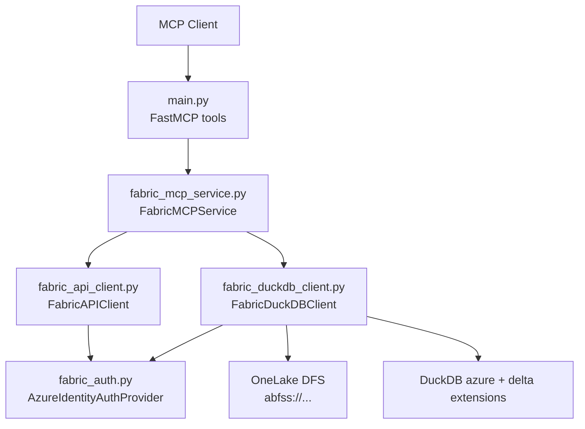
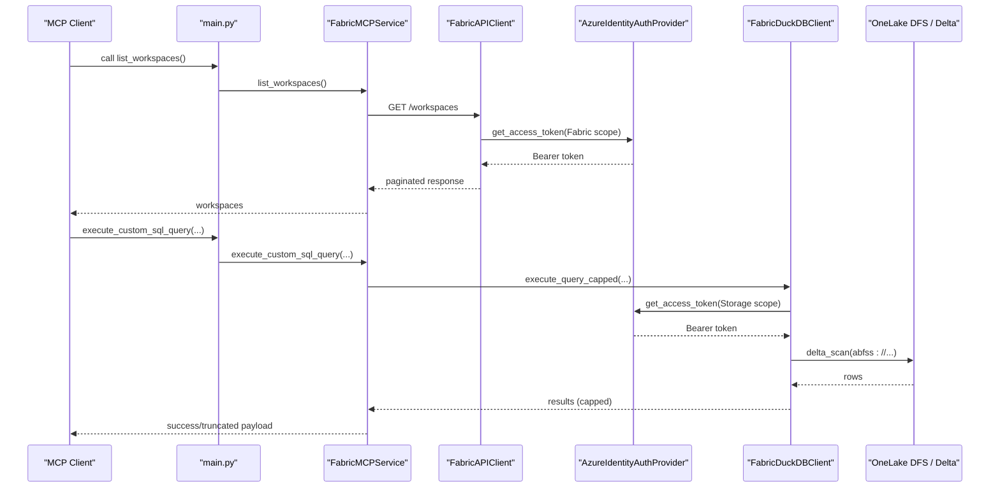
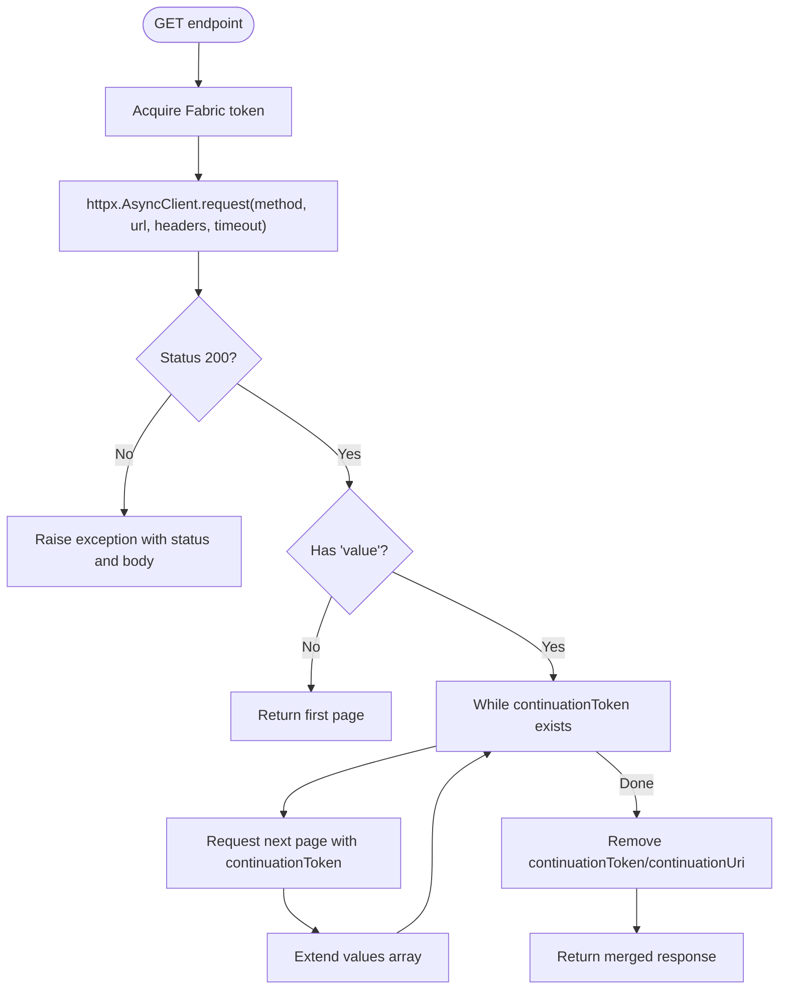
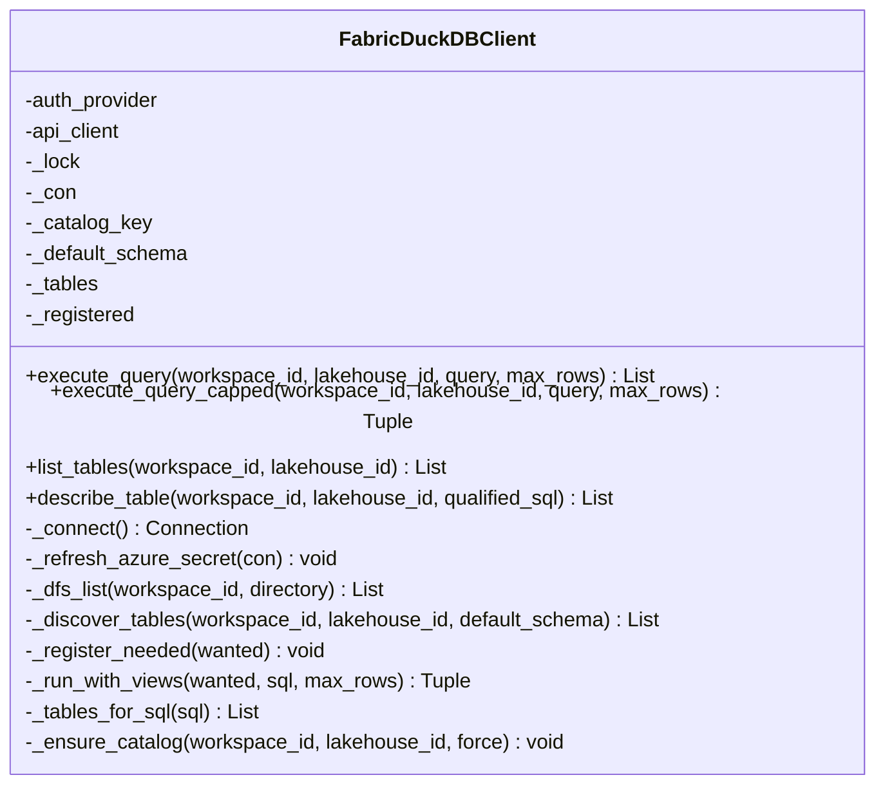
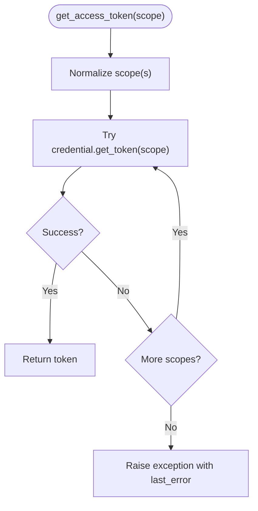
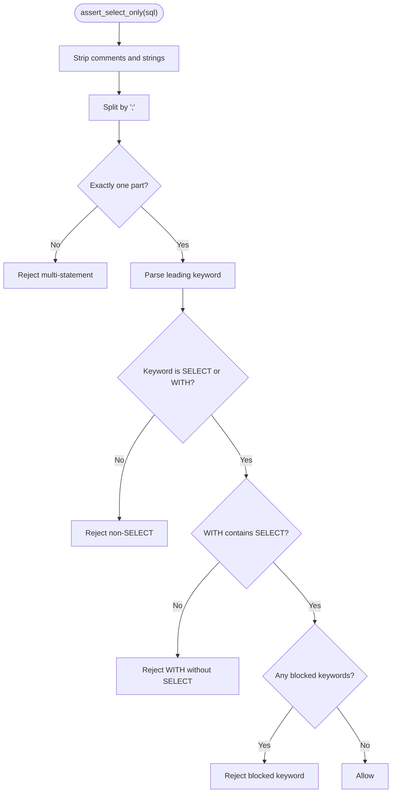
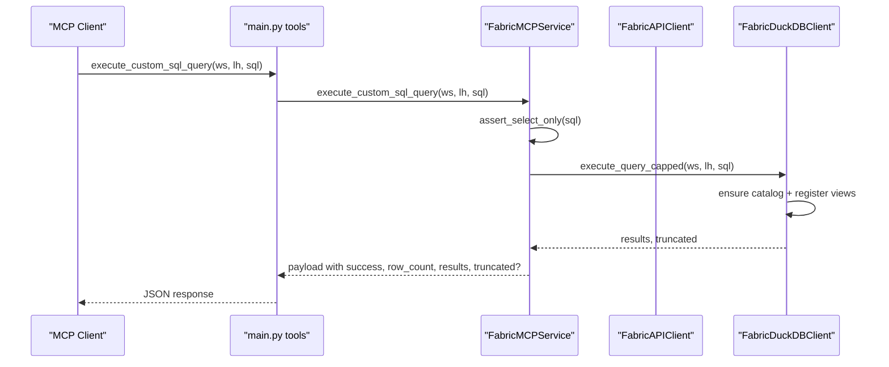
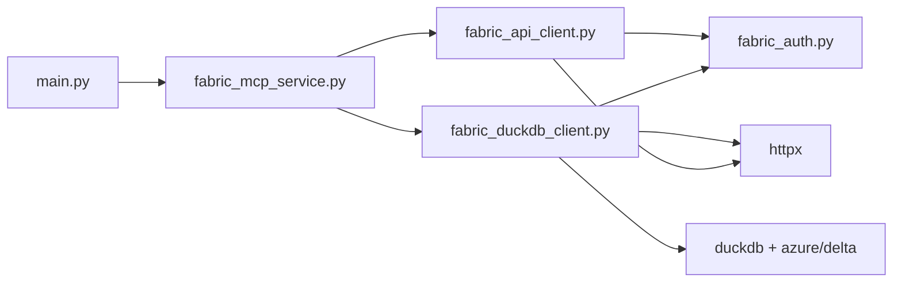

# Microsoft Fabric Integration

<cite>
**Referenced Files in This Document**
- [main.py](file://main.py)
- [fabric_mcp_service.py](file://fabric_mcp_service.py)
- [fabric_api_client.py](file://fabric_api_client.py)
- [fabric_duckdb_client.py](file://fabric_duckdb_client.py)
- [fabric_auth.py](file://fabric_auth.py)
- [sql_validator.py](file://sql_validator.py)
- [README.md](file://README.md)
- [requirements.txt](file://requirements.txt)
- [docs/2-microsoft-fabric-integration.md](file://docs/2-microsoft-fabric-integration.md)
</cite>

## Table of Contents
1. [Introduction](#introduction)
2. [Project Structure](#project-structure)
3. [Core Components](#core-components)
4. [Architecture Overview](#architecture-overview)
5. [Detailed Component Analysis](#detailed-component-analysis)
6. [Dependency Analysis](#dependency-analysis)
7. [Performance Considerations](#performance-considerations)
8. [Troubleshooting Guide](#troubleshooting-guide)
9. [Conclusion](#conclusion)
10. [Appendices](#appendices)

## Introduction
This document explains how the server integrates with Microsoft Fabric to enumerate workspaces and lakehouses via REST APIs, and how DuckDB connects to OneLake Delta tables for data access. It covers pagination handling for large result sets, timeout configurations, error management strategies, OneLake storage access patterns, Delta table format support, Azure storage token management, schema-enabled and schema-less lakehouse handling, different table types, query performance optimization, and common integration challenges such as network connectivity and permission errors.

## Project Structure
The project is organized into a clear separation of concerns:
- MCP tool definitions expose workspace/lakehouse enumeration and SQL execution capabilities.
- A service layer orchestrates authentication, API calls, and SQL execution.
- An HTTP client wraps Fabric REST endpoints with token injection and pagination.
- A DuckDB client discovers tables from OneLake and executes SELECT queries against Delta tables using local DuckDB with azure and delta extensions.
- Authentication abstracts Azure identity token acquisition for both Fabric REST and OneLake storage scopes.
- SQL validation ensures only safe read-only queries are executed.

**Diagram sources**
- [main.py:24-28](file://main.py#L24-L28)
- [fabric_mcp_service.py:14-19](file://fabric_mcp_service.py#L14-L19)
- [fabric_api_client.py:13-19](file://fabric_api_client.py#L13-L19)
- [fabric_duckdb_client.py:124-137](file://fabric_duckdb_client.py#L124-L137)
- [fabric_auth.py:14-42](file://fabric_auth.py#L14-L42)

**Section sources**
- [main.py:1-152](file://main.py#L1-L152)
- [fabric_mcp_service.py:1-153](file://fabric_mcp_service.py#L1-L153)
- [fabric_api_client.py:1-59](file://fabric_api_client.py#L1-L59)
- [fabric_duckdb_client.py:1-438](file://fabric_duckdb_client.py#L1-L438)
- [fabric_auth.py:1-64](file://fabric_auth.py#L1-L64)
- [sql_validator.py:1-124](file://sql_validator.py#L1-L124)
- [README.md:1-257](file://README.md#L1-L257)
- [requirements.txt:1-7](file://requirements.txt#L1-L7)
- [docs/2-microsoft-fabric-integration.md:1-131](file://docs/2-microsoft-fabric-integration.md#L1-L131)

## Core Components
- Fabric MCP Service: Exposes tools for listing workspaces, lakehouses, tables, schemas, sample data, and executing custom SQL.
- Fabric REST API Client: Wraps httpx calls to api.fabric.microsoft.com/v1 with bearer tokens and automatic continuation token pagination.
- DuckDB Client: Discovers OneLake Delta tables by listing directories, registers views over delta_scan, and executes SELECT queries with row limits.
- Azure Identity Auth Provider: Acquires tokens for Fabric REST scope and OneLake storage scope using DefaultAzureCredential or ClientSecretCredential.
- SQL Validator: Enforces single SELECT/WITH…SELECT statements and blocks dangerous keywords.

Key responsibilities:
- Enumerate resources via REST with pagination.
- Discover tables via OneLake DFS without opening Delta files.
- Execute queries locally through DuckDB against OneLake-backed Delta tables.
- Manage timeouts, retries (via caller), and robust error messages.

**Section sources**
- [fabric_mcp_service.py:14-153](file://fabric_mcp_service.py#L14-L153)
- [fabric_api_client.py:13-59](file://fabric_api_client.py#L13-L59)
- [fabric_duckdb_client.py:124-438](file://fabric_duckdb_client.py#L124-L438)
- [fabric_auth.py:14-64](file://fabric_auth.py#L14-L64)
- [sql_validator.py:80-105](file://sql_validator.py#L80-L105)

## Architecture Overview
The system uses two primary paths:
- Catalog path: Fabric REST API to list workspaces and lakehouses.
- Data path: DuckDB with azure/delta extensions reading OneLake Delta tables via abfss URIs authenticated with an Azure storage access token.

**Diagram sources**
- [main.py:35-143](file://main.py#L35-L143)
- [fabric_mcp_service.py:56-153](file://fabric_mcp_service.py#L56-L153)
- [fabric_api_client.py:21-49](file://fabric_api_client.py#L21-L49)
- [fabric_duckdb_client.py:135-162](file://fabric_duckdb_client.py#L135-L162)
- [fabric_duckdb_client.py:369-392](file://fabric_duckdb_client.py#L369-L392)
- [fabric_auth.py:34-42](file://fabric_auth.py#L34-L42)

## Detailed Component Analysis

### Fabric REST API Client
- Base URL and scope: Uses a fixed base URL and Fabric API scope for token acquisition.
- Token injection: Adds Authorization header with Bearer token per request.
- Timeout configuration: Each request uses a default timeout; callers can override via kwargs.
- Pagination: The get method automatically follows continuationToken across pages, merging all value arrays and removing continuation fields before returning.

**Diagram sources**
- [fabric_api_client.py:21-49](file://fabric_api_client.py#L21-L49)

**Section sources**
- [fabric_api_client.py:1-59](file://fabric_api_client.py#L1-L59)

### DuckDB Client for OneLake Delta Tables
- Connection setup: Installs and loads azure and delta extensions, configures transport option.
- Secret management: Creates or replaces an Azure secret with an access token scoped to storage.
- Table discovery: Lists OneLake Tables directory via DFS API, filters system directories, detects Delta tables by presence of _delta_log, and builds abfss paths.
- View registration: For each discovered table, creates a schema and a view that selects from delta_scan on the abfss path.
- Query execution: Parses referenced tables from SQL, registers only needed views, executes the query, and caps results to a configurable maximum.
- Schema discovery: Describes tables via DESCRIBE and maps columns to a standard structure.

**Diagram sources**
- [fabric_duckdb_client.py:124-438](file://fabric_duckdb_client.py#L124-L438)

**Section sources**
- [fabric_duckdb_client.py:1-438](file://fabric_duckdb_client.py#L1-L438)

### Azure Identity Authentication Provider
- Supports interactive login via DefaultAzureCredential or service principal via ClientSecretCredential based on environment variables.
- Provides get_access_token for multiple scopes: Fabric REST and OneLake storage.
- Aggregates last error if none of the scopes succeed.

**Diagram sources**
- [fabric_auth.py:34-42](file://fabric_auth.py#L34-L42)

**Section sources**
- [fabric_auth.py:1-64](file://fabric_auth.py#L1-L64)

### SQL Validator
- Ensures only a single SELECT or WITH…SELECT statement is allowed.
- Strips comments and strings to avoid bypasses.
- Blocks a comprehensive set of DDL/DML/admin keywords to prevent unsafe operations.

**Diagram sources**
- [sql_validator.py:47-105](file://sql_validator.py#L47-L105)

**Section sources**
- [sql_validator.py:1-124](file://sql_validator.py#L1-L124)

### MCP Tools and Service Layer
- Tools: list_workspaces, list_lakehouses, get_lakehouse_tables, get_table_schema, get_table_sample_data, execute_custom_sql_query.
- Validation: Limits and identifiers are validated; SQL is restricted to SELECT-only.
- Error handling: Returns structured responses with error fields when failures occur.

**Diagram sources**
- [main.py:123-143](file://main.py#L123-L143)
- [fabric_mcp_service.py:125-153](file://fabric_mcp_service.py#L125-L153)
- [fabric_duckdb_client.py:369-392](file://fabric_duckdb_client.py#L369-L392)
- [sql_validator.py:80-105](file://sql_validator.py#L80-L105)

**Section sources**
- [main.py:35-143](file://main.py#L35-L143)
- [fabric_mcp_service.py:14-153](file://fabric_mcp_service.py#L14-L153)

## Dependency Analysis
- main.py depends on FastMCP and FabricMCPService.
- FabricMCPService depends on auth provider, FabricAPIClient, FabricDuckDBClient, and SQL validator.
- FabricAPIClient depends on auth provider and httpx.
- FabricDuckDBClient depends on auth provider, FabricAPIClient, duckdb, httpx, and SQL validator utilities.
- External dependencies include azure-identity, httpx, duckdb, python-dotenv, fastmcp.

**Diagram sources**
- [main.py:24-28](file://main.py#L24-L28)
- [fabric_mcp_service.py:14-19](file://fabric_mcp_service.py#L14-L19)
- [fabric_api_client.py:5-8](file://fabric_api_client.py#L5-L8)
- [fabric_duckdb_client.py:5-15](file://fabric_duckdb_client.py#L5-L15)
- [requirements.txt:1-7](file://requirements.txt#L1-L7)

**Section sources**
- [requirements.txt:1-7](file://requirements.txt#L1-L7)
- [fabric_api_client.py:1-59](file://fabric_api_client.py#L1-L59)
- [fabric_duckdb_client.py:1-438](file://fabric_duckdb_client.py#L1-L438)
- [fabric_mcp_service.py:1-153](file://fabric_mcp_service.py#L1-L153)
- [main.py:1-152](file://main.py#L1-L152)

## Performance Considerations
- Result cap: Queries are capped at a default maximum number of rows to avoid large payloads; truncation is signaled in the response.
- Lazy view registration: Only tables referenced by the SQL are registered as views, minimizing overhead.
- Directory-based discovery: Tables are discovered by listing OneLake directories rather than scanning Delta files, reducing I/O.
- Extension loading: DuckDB azure and delta extensions are installed once per connection; reuse connections where possible.
- Timeouts: HTTP requests use explicit timeouts; adjust per environment needs.

[No sources needed since this section provides general guidance]

## Troubleshooting Guide
Common issues and resolutions:
- Token acquisition fails:
  - Ensure az login targets the same tenant as Fabric or configure service principal credentials.
  - Verify required permissions (Workspace Viewer or higher) and OneLake external access settings.
- OneLake list or read fails:
  - Confirm OneLake external access is enabled and the identity has appropriate roles.
  - Handle 403 errors with hints about permissions and OneLake security roles.
  - Network issues may require retry logic; initial extension downloads need outbound connectivity.
- DuckDB reads fail:
  - First run downloads DuckDB azure and delta extensions; ensure network access.
  - Use workspace and lakehouse GUIDs, not display names.
  - If encountering known OneLake list-API bugs, prefer GUID-based paths.
- Invalid SQL:
  - Only single SELECT or WITH…SELECT is allowed; DDL/DML and certain keywords are blocked.
  - Use LIMIT instead of TOP; quote identifiers as needed.

**Section sources**
- [README.md:234-245](file://README.md#L234-L245)
- [fabric_duckdb_client.py:183-206](file://fabric_duckdb_client.py#L183-L206)
- [sql_validator.py:80-105](file://sql_validator.py#L80-L105)

## Conclusion
This integration combines Fabric REST APIs for resource enumeration and DuckDB with OneLake Delta for efficient, secure data access. It supports both schema-enabled and schema-less lakehouses, handles pagination and timeouts, and enforces safe query execution. Proper authentication and permissions are essential for reliable operation.

[No sources needed since this section summarizes without analyzing specific files]

## Appendices

### OneLake Storage Access Patterns
- Abfss paths: Constructed using workspace and lakehouse GUIDs for stable addressing.
- Delta detection: Presence of _delta_log indicates a Delta table; otherwise treated as folder-based tables.
- Secret refresh: Azure secrets are refreshed per connection to keep tokens current.

**Section sources**
- [fabric_duckdb_client.py:76-81](file://fabric_duckdb_client.py#L76-L81)
- [fabric_duckdb_client.py:67-73](file://fabric_duckdb_client.py#L67-L73)
- [fabric_duckdb_client.py:150-162](file://fabric_duckdb_client.py#L150-L162)

### Handling Schema-Enabled and Schema-Less Lakehouses
- Discovery lists OneLake Tables directory and infers schema from folder structure; default schema is used when not specified.
- Views are created under inferred or default schemas to support both cases uniformly.

**Section sources**
- [fabric_duckdb_client.py:227-256](file://fabric_duckdb_client.py#L227-L256)
- [fabric_duckdb_client.py:322-333](file://fabric_duckdb_client.py#L322-L333)

### Azure Storage Token Management
- Tokens are acquired for storage scope and injected into DuckDB secrets for OneLake access.
- Errors during token acquisition surface with context to aid troubleshooting.

**Section sources**
- [fabric_duckdb_client.py:135-162](file://fabric_duckdb_client.py#L135-L162)
- [fabric_auth.py:34-42](file://fabric_auth.py#L34-L42)

### Query Performance Optimization Tips
- Use LIMIT to reduce result sizes.
- Prefer filtering and aggregation in SQL to minimize data transfer.
- Avoid unnecessary joins; leverage WHERE clauses early.
- Reuse connections implicitly via client instance lifecycle.

[No sources needed since this section provides general guidance]