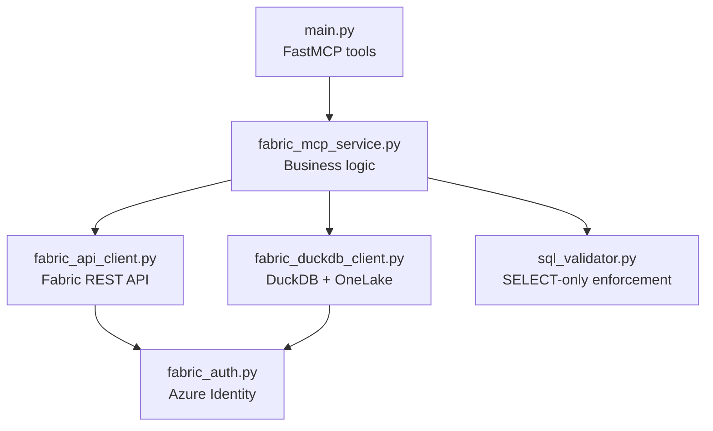
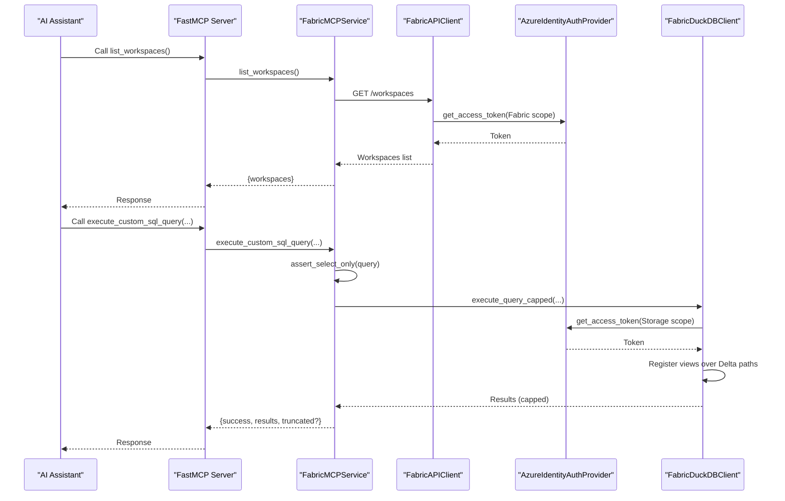
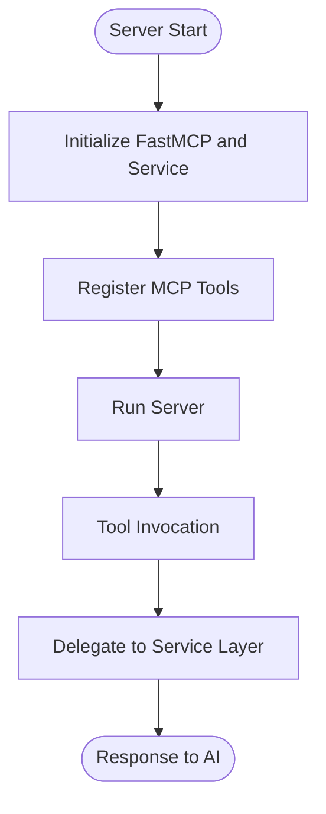
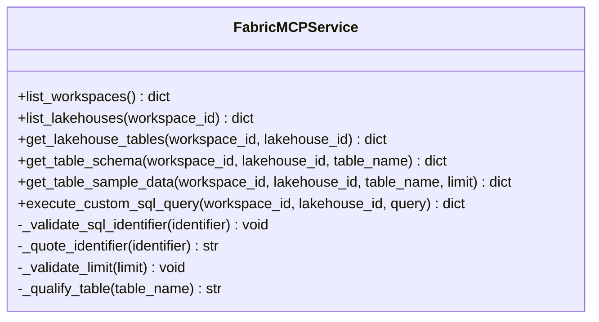
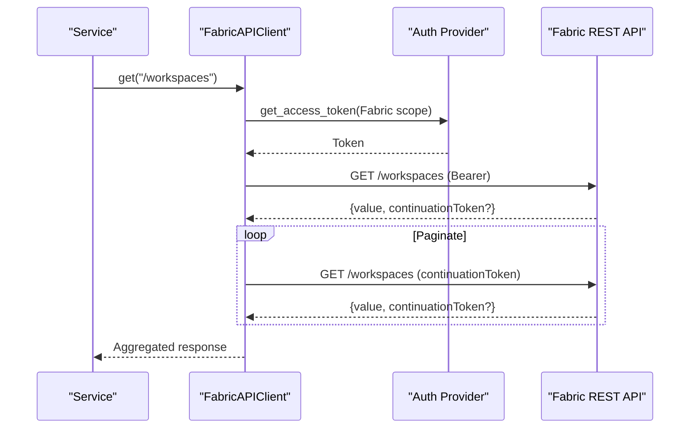
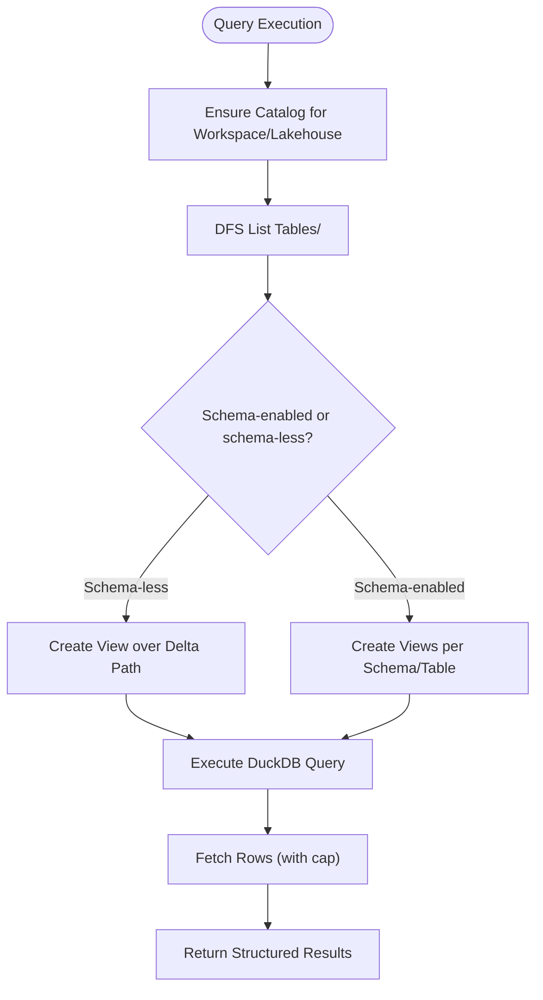
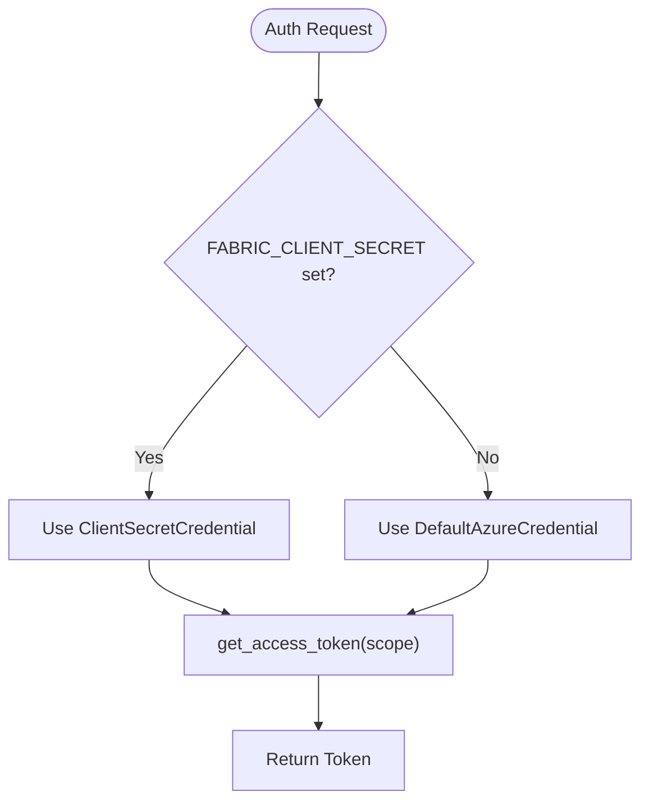
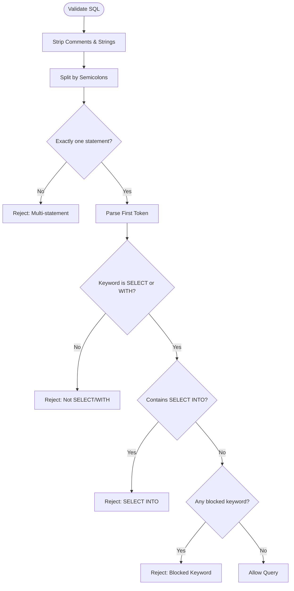
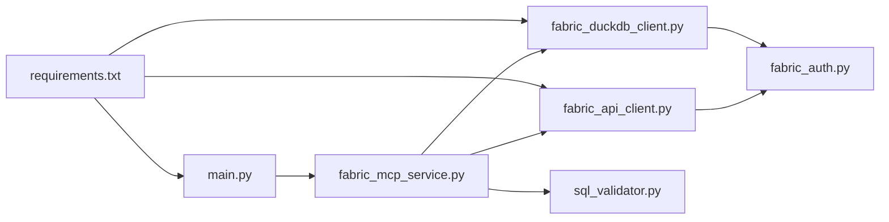

# Project Overview

<cite>
**Referenced Files in This Document**
- [README.md](file://README.md)
- [main.py](file://main.py)
- [fabric_mcp_service.py](file://fabric_mcp_service.py)
- [fabric_api_client.py](file://fabric_api_client.py)
- [fabric_auth.py](file://fabric_auth.py)
- [fabric_duckdb_client.py](file://fabric_duckdb_client.py)
- [sql_validator.py](file://sql_validator.py)
- [requirements.txt](file://requirements.txt)
- [PLAN.md](file://PLAN.md)
</cite>

## Table of Contents
1. [Introduction](#introduction)
2. [Project Structure](#project-structure)
3. [Core Components](#core-components)
4. [Architecture Overview](#architecture-overview)
5. [Detailed Component Analysis](#detailed-component-analysis)
6. [Dependency Analysis](#dependency-analysis)
7. [Performance Considerations](#performance-considerations)
8. [Troubleshooting Guide](#troubleshooting-guide)
9. [Conclusion](#conclusion)

## Introduction
Fabric MCP Server is a Model Context Protocol (MCP) server that enables AI assistants to explore Microsoft Fabric lakehouses safely and read-only. It exposes tools for workspace discovery, lakehouse enumeration, table listing, schema inspection, sample data retrieval, and custom SQL query execution against OneLake Delta tables. The server bridges AI assistants with Microsoft Fabric’s data platform through standardized MCP tool calls, using Azure Identity for authentication and DuckDB for local, secure querying over OneLake.

Key features:
- Workspace discovery via the Fabric REST API
- Lakehouse enumeration within a workspace
- Table enumeration across schema-enabled and schema-less lakehouses
- Schema inspection for columns and types
- Sample data access with row limits
- Custom SELECT-only SQL execution with strict validation and result caps

Target audience:
- Developers building AI-powered data exploration tools
- Data analysts who want natural language access to enterprise Fabric data
- Teams integrating AI assistants (e.g., GitHub Copilot) with Microsoft Fabric workspaces

Technology stack:
- Python 3.12+
- FastMCP for MCP server implementation
- httpx for async HTTP requests
- azure-identity for token acquisition (Azure CLI or service principal)
- DuckDB with azure and delta extensions for reading OneLake Delta files
- python-dotenv for configuration

Security boundaries:
- Read-only access enforced by design and SQL validation
- Storage tokens refreshed per operation with short-lived credentials
- No writes, DDL, or multi-statement batches allowed
- Strict identifier validation and safe quoting to prevent injection

[No sources needed since this section provides general project context]

## Project Structure
The repository is organized around an MCP entry point, a service layer, and specialized clients for Fabric REST APIs, authentication, and DuckDB-based queries. Documentation and planning notes provide additional context on architecture and decisions.

**Diagram sources**
- [main.py:1-152](file://main.py#L1-L152)
- [fabric_mcp_service.py:1-153](file://fabric_mcp_service.py#L1-L153)
- [fabric_api_client.py:1-59](file://fabric_api_client.py#L1-L59)
- [fabric_duckdb_client.py:1-438](file://fabric_duckdb_client.py#L1-L438)
- [sql_validator.py:1-124](file://sql_validator.py#L1-L124)
- [fabric_auth.py:1-64](file://fabric_auth.py#L1-L64)

**Section sources**
- [main.py:1-152](file://main.py#L1-L152)
- [fabric_mcp_service.py:1-153](file://fabric_mcp_service.py#L1-L153)
- [requirements.txt:1-7](file://requirements.txt#L1-L7)
- [PLAN.md:1-73](file://PLAN.md#L1-L73)

## Core Components
- MCP Tools: Exposed functions registered with FastMCP that map to user-facing capabilities like listing workspaces, enumerating lakehouses, discovering tables, inspecting schemas, sampling data, and executing custom SQL.
- Service Layer: Orchestrates calls to REST and DuckDB clients, validates inputs, qualifies identifiers, and enforces safety constraints.
- Fabric REST Client: Handles authenticated requests to the Fabric API with pagination support.
- Authentication Provider: Acquires tokens via Azure CLI or service principal using azure-identity.
- DuckDB Client: Manages local DuckDB connections, registers views over OneLake Delta paths, refreshes storage secrets, and executes queries safely.
- SQL Validator: Enforces SELECT-only policy, stripping comments/strings and rejecting dangerous keywords.

**Section sources**
- [main.py:35-143](file://main.py#L35-L143)
- [fabric_mcp_service.py:14-153](file://fabric_mcp_service.py#L14-L153)
- [fabric_api_client.py:13-59](file://fabric_api_client.py#L13-L59)
- [fabric_auth.py:14-64](file://fabric_auth.py#L14-L64)
- [fabric_duckdb_client.py:124-438](file://fabric_duckdb_client.py#L124-L438)
- [sql_validator.py:80-105](file://sql_validator.py#L80-L105)

## Architecture Overview
The server implements a layered architecture:
- MCP Tools layer: Declares tools with descriptive docstrings and type hints for AI assistants.
- Service layer: Validates inputs, constructs safe queries, and coordinates client calls.
- Clients:
  - FabricAPIClient: Calls Fabric REST endpoints with bearer tokens and handles continuation tokens for paginated lists.
  - FabricDuckDBClient: Discovers tables via OneLake DFS, creates lazy views over Delta paths, and runs DuckDB queries with scoped permissions.
- Authentication: Centralized via AzureIdentityAuthProvider, supporting interactive login and service principal modes.

**Diagram sources**
- [main.py:35-143](file://main.py#L35-L143)
- [fabric_mcp_service.py:56-153](file://fabric_mcp_service.py#L56-L153)
- [fabric_api_client.py:21-49](file://fabric_api_client.py#L21-L49)
- [fabric_auth.py:34-42](file://fabric_auth.py#L34-L42)
- [fabric_duckdb_client.py:369-392](file://fabric_duckdb_client.py#L369-L392)
- [sql_validator.py:80-105](file://sql_validator.py#L80-L105)

## Detailed Component Analysis

### MCP Tools and Entry Point
- Tools are declared with @mcp.tool(), each with clear docstrings describing purpose, parameters, and return shapes.
- Tools delegate to FabricMCPService methods, ensuring consistent behavior and error handling.
- The server initializes FastMCP and runs via main.py.

**Diagram sources**
- [main.py:24-152](file://main.py#L24-L152)

**Section sources**
- [main.py:1-152](file://main.py#L1-L152)

### Service Layer: FabricMCPService
- Validates identifiers and limits; qualifies table names safely.
- Coordinates REST calls for workspaces/lakehouses and DuckDB operations for tables/schema/data.
- Enforces SELECT-only policy before executing custom SQL.

**Diagram sources**
- [fabric_mcp_service.py:14-153](file://fabric_mcp_service.py#L14-L153)

**Section sources**
- [fabric_mcp_service.py:14-153](file://fabric_mcp_service.py#L14-L153)

### Fabric REST Client
- Uses httpx for async requests with bearer tokens from AzureIdentityAuthProvider.
- Implements pagination by following continuation tokens for list endpoints.
- Provides generic GET/POST/PUT/DELETE methods tailored for Fabric API base URL.

**Diagram sources**
- [fabric_api_client.py:21-49](file://fabric_api_client.py#L21-L49)
- [fabric_auth.py:34-42](file://fabric_auth.py#L34-L42)

**Section sources**
- [fabric_api_client.py:1-59](file://fabric_api_client.py#L1-L59)

### DuckDB Client and OneLake Integration
- Discovers tables by listing OneLake DFS directories under Tables/, detecting schema-enabled vs schema-less structures.
- Creates lazy views over Delta paths using delta_scan, refreshing Azure storage secrets per operation.
- Executes queries with optional row capping and returns structured records.

**Diagram sources**
- [fabric_duckdb_client.py:227-256](file://fabric_duckdb_client.py#L227-L256)
- [fabric_duckdb_client.py:369-392](file://fabric_duckdb_client.py#L369-L392)

**Section sources**
- [fabric_duckdb_client.py:1-438](file://fabric_duckdb_client.py#L1-L438)

### Authentication Provider
- Supports interactive login via Azure CLI (DefaultAzureCredential) and service principal mode when environment variables are set.
- Provides a unified interface to acquire tokens for different scopes (Fabric API and Azure Storage).

**Diagram sources**
- [fabric_auth.py:45-64](file://fabric_auth.py#L45-L64)
- [fabric_auth.py:34-42](file://fabric_auth.py#L34-L42)

**Section sources**
- [fabric_auth.py:1-64](file://fabric_auth.py#L1-L64)

### SQL Validator
- Strips comments and string literals to avoid evasion.
- Rejects multi-statement batches and disallowed keywords.
- Ensures only SELECT or WITH…SELECT statements pass.

**Diagram sources**
- [sql_validator.py:47-105](file://sql_validator.py#L47-L105)

**Section sources**
- [sql_validator.py:1-124](file://sql_validator.py#L1-L124)

## Dependency Analysis
The system has clear separation of concerns:
- main.py depends on FastMCP and FabricMCPService.
- FabricMCPService depends on FabricAPIClient, FabricDuckDBClient, and sql_validator.
- FabricDuckDBClient depends on FabricAPIClient and AzureIdentityAuthProvider.
- FabricAPIClient depends on AzureIdentityAuthProvider.
- All components rely on requirements.txt dependencies.

**Diagram sources**
- [main.py:19-28](file://main.py#L19-L28)
- [fabric_mcp_service.py:6-11](file://fabric_mcp_service.py#L6-L11)
- [fabric_api_client.py:5-8](file://fabric_api_client.py#L5-L8)
- [fabric_duckdb_client.py:10-15](file://fabric_duckdb_client.py#L10-L15)
- [requirements.txt:1-7](file://requirements.txt#L1-L7)

**Section sources**
- [main.py:19-28](file://main.py#L19-L28)
- [fabric_mcp_service.py:6-11](file://fabric_mcp_service.py#L6-L11)
- [requirements.txt:1-7](file://requirements.txt#L1-L7)

## Performance Considerations
- Local DuckDB compute avoids Fabric Spark/SQL CUs; queries run on the client machine.
- Table discovery uses OneLake DFS listing without recursively scanning Parquet files.
- Views are created lazily only for referenced tables to minimize overhead.
- Result sets are capped at 1000 rows to prevent excessive data transfer.
- Storage tokens are refreshed per operation due to short expiration.

[No sources needed since this section provides general guidance]

## Troubleshooting Guide
Common issues and resolutions:
- Token acquisition fails: Ensure az login targets the correct tenant; verify workspace roles and OneLake external access settings.
- DuckDB/OneLake read failures: Confirm network access for DuckDB extensions; use GUIDs for workspace/lakehouse paths; retry transient errors.
- Tools not appearing: Verify MCP command points to the virtual environment Python; restart server after dependency changes.

**Section sources**
- [README.md:234-249](file://README.md#L234-L249)

## Conclusion
Fabric MCP Server provides a secure, read-only bridge between AI assistants and Microsoft Fabric lakehouses. By combining FastMCP, Azure Identity, and DuckDB, it enables natural language interactions over enterprise data while enforcing strict security boundaries. The modular architecture supports easy extension and integration into AI workflows, making it suitable for developers building data exploration tools powered by AI.

[No sources needed since this section summarizes without analyzing specific files]