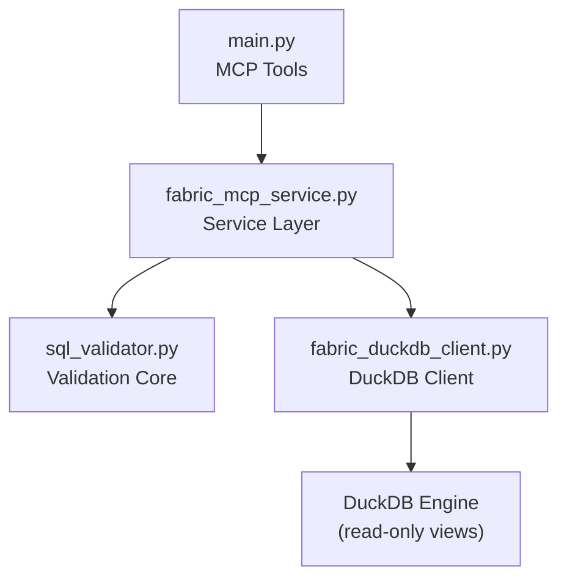
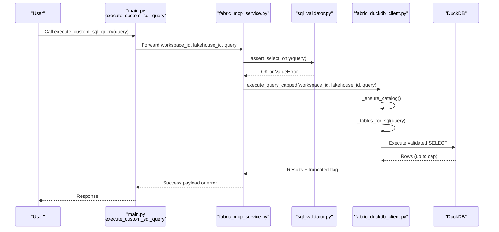
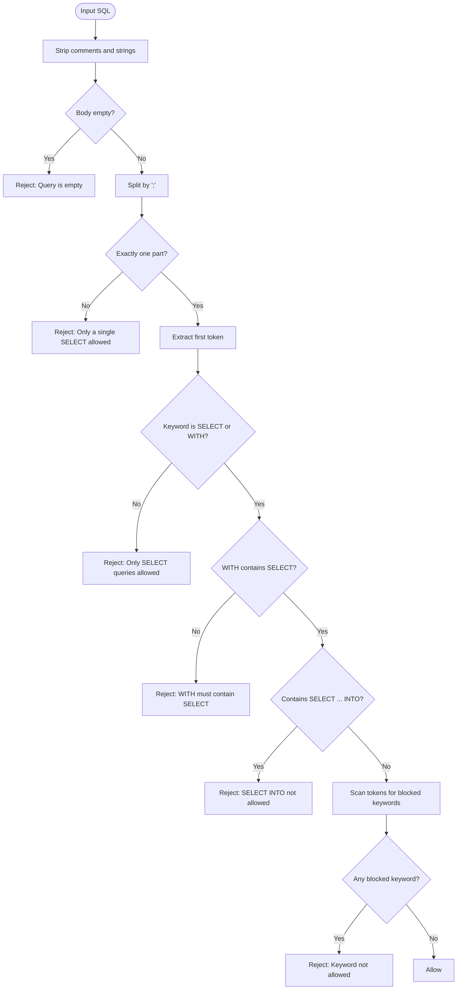
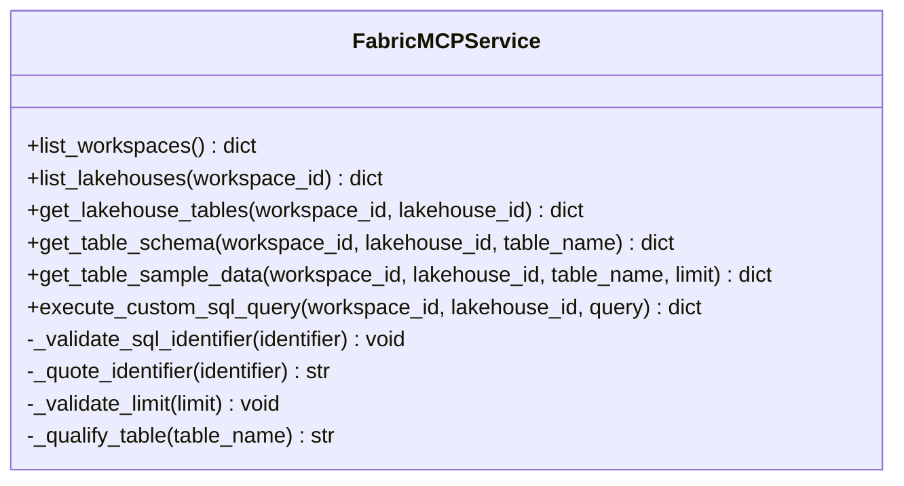
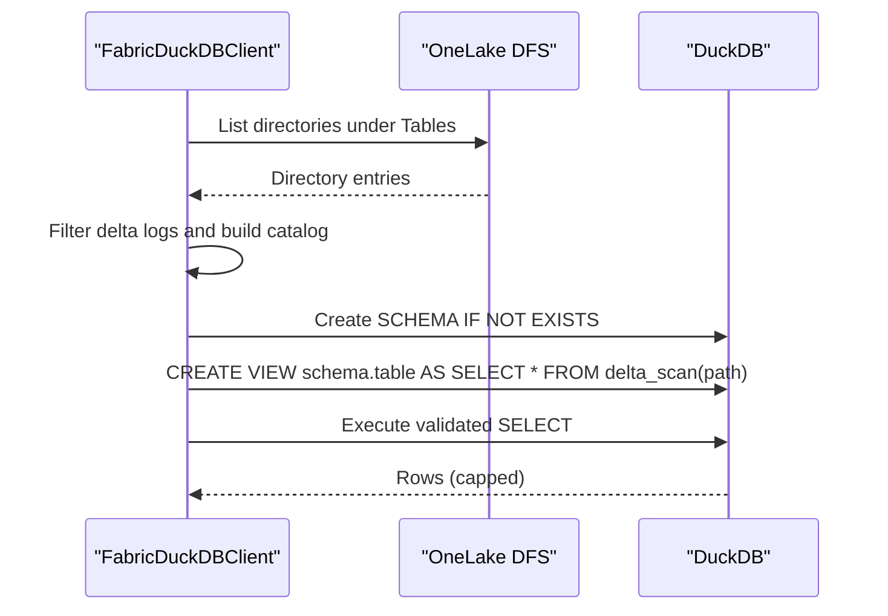
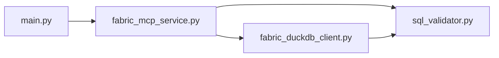

# SQL Validation and Security

<cite>
**Referenced Files in This Document**
- [sql_validator.py](file://sql_validator.py)
- [test_sql_validator.py](file://test_sql_validator.py)
- [fabric_mcp_service.py](file://fabric_mcp_service.py)
- [fabric_duckdb_client.py](file://fabric_duckdb_client.py)
- [main.py](file://main.py)
</cite>

## Table of Contents
1. [Introduction](#introduction)
2. [Project Structure](#project-structure)
3. [Core Components](#core-components)
4. [Architecture Overview](#architecture-overview)
5. [Detailed Component Analysis](#detailed-component-analysis)
6. [Dependency Analysis](#dependency-analysis)
7. [Performance Considerations](#performance-considerations)
8. [Troubleshooting Guide](#troubleshooting-guide)
9. [Conclusion](#conclusion)
10. [Appendices](#appendices)

## Introduction
This document explains the SQL validation and security system that protects the Fabric MCP server from SQL injection, unauthorized operations, and multi-statement attacks. It covers:
- Blocked keyword detection to prevent write and administrative operations
- Comment and string literal stripping for accurate parsing
- Single-statement enforcement to block multi-statement batches
- Security constraints enforced at each layer (API tool, service, client)
- Examples of valid and invalid queries with reasons
- Guidance for extending validation rules and testing new measures
- Performance considerations and optimization techniques

## Project Structure
The SQL security pipeline spans several modules:
- API tools expose controlled entry points and enforce read-only semantics
- Service layer validates inputs and enforces policy before execution
- Client layer performs safe table discovery and query execution against DuckDB
- Validator module provides core SQL parsing and blocking logic

**Diagram sources**
- [main.py:123-143](file://main.py#L123-L143)
- [fabric_mcp_service.py:125-152](file://fabric_mcp_service.py#L125-L152)
- [sql_validator.py:80-104](file://sql_validator.py#L80-L104)
- [fabric_duckdb_client.py:369-392](file://fabric_duckdb_client.py#L369-L392)

**Section sources**
- [main.py:1-152](file://main.py#L1-L152)
- [fabric_mcp_service.py:1-153](file://fabric_mcp_service.py#L1-L153)
- [sql_validator.py:1-124](file://sql_validator.py#L1-L124)
- [fabric_duckdb_client.py:1-438](file://fabric_duckdb_client.py#L1-L438)

## Core Components
- SQL validator: Centralizes blocked keywords, comment/string stripping, single-statement enforcement, and SELECT-only checks
- Service layer: Validates identifiers, limits, and table names; invokes validator before execution
- DuckDB client: Discovers tables via OneLake, registers read-only views, executes queries safely with row caps

Key responsibilities:
- Reject non-SELECT statements and dangerous keywords
- Strip comments and string literals to avoid evasion
- Enforce exactly one statement per query
- Limit result sets to prevent resource exhaustion
- Restrict access to known tables via dynamic view registration

**Section sources**
- [sql_validator.py:7-44](file://sql_validator.py#L7-L44)
- [sql_validator.py:47-104](file://sql_validator.py#L47-L104)
- [fabric_mcp_service.py:21-54](file://fabric_mcp_service.py#L21-L54)
- [fabric_duckdb_client.py:101-117](file://fabric_duckdb_client.py#L101-L117)
- [fabric_duckdb_client.py:258-296](file://fabric_duckdb_client.py#L258-L296)
- [fabric_duckdb_client.py:335-392](file://fabric_duckdb_client.py#L335-L392)

## Architecture Overview
The end-to-end flow for a custom SQL query ensures safety at every step:

**Diagram sources**
- [main.py:123-143](file://main.py#L123-L143)
- [fabric_mcp_service.py:125-152](file://fabric_mcp_service.py#L125-L152)
- [sql_validator.py:80-104](file://sql_validator.py#L80-L104)
- [fabric_duckdb_client.py:322-392](file://fabric_duckdb_client.py#L322-L392)

## Detailed Component Analysis

### SQL Validator: Blocked Keywords, Stripping, and Enforcement
- Blocked keywords: A comprehensive set prevents writes, DDL, administration, and data movement commands
- Comment and string stripping: Removes line comments, block comments, and string literals so hidden commands cannot bypass checks
- Single-statement enforcement: Ensures only one statement exists by splitting on semicolons and validating count
- SELECT-only enforcement: Allows SELECT and WITH…SELECT; rejects INTO, EXPLAIN, and other non-SELECT patterns
- Token scanning: Scans all tokens after stripping to detect any blocked keyword anywhere in the query

**Diagram sources**
- [sql_validator.py:47-104](file://sql_validator.py#L47-L104)

**Section sources**
- [sql_validator.py:7-44](file://sql_validator.py#L7-L44)
- [sql_validator.py:47-104](file://sql_validator.py#L47-L104)

### Service Layer: Input Validation and Policy Enforcement
- Identifier validation: Ensures schema/table names contain only safe characters and are properly quoted
- Limit validation: Enforces positive integer limits for sample queries
- Table qualification: Builds safe qualified names using validated identifiers
- Execution gating: Calls the validator before any query execution

**Diagram sources**
- [fabric_mcp_service.py:14-54](file://fabric_mcp_service.py#L14-L54)
- [fabric_mcp_service.py:75-152](file://fabric_mcp_service.py#L75-L152)

**Section sources**
- [fabric_mcp_service.py:21-54](file://fabric_mcp_service.py#L21-L54)
- [fabric_mcp_service.py:75-152](file://fabric_mcp_service.py#L75-L152)

### DuckDB Client: Safe Table Discovery and Execution
- Table discovery: Enumerates OneLake Delta tables without opening files; builds a catalog of schema.table paths
- View registration: Creates temporary read-only views for referenced tables only, minimizing exposure
- Query execution: Executes validated SELECTs with optional row caps and returns JSON-safe results
- Security boundaries: Uses pre-approved secrets and avoids direct file path injection

**Diagram sources**
- [fabric_duckdb_client.py:227-256](file://fabric_duckdb_client.py#L227-L256)
- [fabric_duckdb_client.py:258-296](file://fabric_duckdb_client.py#L258-L296)
- [fabric_duckdb_client.py:335-392](file://fabric_duckdb_client.py#L335-L392)

**Section sources**
- [fabric_duckdb_client.py:101-117](file://fabric_duckdb_client.py#L101-L117)
- [fabric_duckdb_client.py:227-296](file://fabric_duckdb_client.py#L227-L296)
- [fabric_duckdb_client.py:335-392](file://fabric_duckdb_client.py#L335-L392)

### API Tool: Controlled Entry Point
- The execute_custom_sql_query tool documents read-only behavior and rejections for writes, DDL, COPY, ATTACH, and multi-statement batches
- It delegates to the service layer which enforces validation and caps results

**Section sources**
- [main.py:123-143](file://main.py#L123-L143)

## Dependency Analysis
- main.py exposes tools that call fabric_mcp_service methods
- fabric_mcp_service imports and uses sql_validator.assert_select_only and fabric_duckdb_client
- fabric_duckdb_client imports sql_validator._strip_comments_and_strings for table reference extraction
- Tests validate validator behavior and ensure expected rejections

**Diagram sources**
- [main.py:123-143](file://main.py#L123-L143)
- [fabric_mcp_service.py:11-12](file://fabric_mcp_service.py#L11-L12)
- [fabric_duckdb_client.py:15-15](file://fabric_duckdb_client.py#L15-L15)

**Section sources**
- [main.py:123-143](file://main.py#L123-L143)
- [fabric_mcp_service.py:11-12](file://fabric_mcp_service.py#L11-L12)
- [fabric_duckdb_client.py:15-15](file://fabric_duckdb_client.py#L15-L15)

## Performance Considerations
- Comment and string stripping runs once per validation and per table reference extraction; it is linear in input size and avoids regex overhead for most cases
- Blocking keyword scan uses tokenization over stripped text; keep queries concise to minimize scanning cost
- Table discovery enumerates directories once per catalog key and caches results; avoid forcing refresh unless necessary
- Row caps prevent large result sets; prefer LIMIT in queries to reduce memory and network usage
- View registration is incremental based on referenced tables; this reduces unnecessary setup work

[No sources needed since this section provides general guidance]

## Troubleshooting Guide
Common rejection reasons and how to address them:
- Empty query: Ensure the query string is non-empty and not just whitespace
- Multi-statement: Remove semicolons to combine into a single SELECT; use subqueries or CTEs instead of multiple statements
- Non-SELECT keyword: Replace DDL/DML with equivalent read-only analysis; use WITH clauses to structure complex reads
- SELECT INTO: Rewrite to standard SELECT; do not attempt to create tables or export via INTO
- Blocked keywords: Remove or replace any command that modifies state or accesses external resources
- Invalid identifiers: Use only letters, digits, underscores, and hyphens; quote identifiers when necessary

Where to look:
- Validator errors originate from assert_select_only
- Identifier and limit validation errors originate from service helper methods
- Execution errors may come from DuckDB or OneLake integration

**Section sources**
- [sql_validator.py:80-104](file://sql_validator.py#L80-L104)
- [fabric_mcp_service.py:21-54](file://fabric_mcp_service.py#L21-L54)

## Conclusion
The SQL validation and security system enforces a strict read-only model through layered protections:
- Centralized keyword blocking and pattern checks in the validator
- Robust comment and string stripping to prevent evasion
- Single-statement enforcement to eliminate batch attacks
- Service-level input validation and safe identifier handling
- Client-side table discovery and view-based access control with row caps
Together, these layers ensure safe exploration and analysis of Microsoft Fabric lakehouse data while preventing injection and unauthorized operations.

[No sources needed since this section summarizes without analyzing specific files]

## Appendices

### Valid and Invalid Query Patterns
Valid:
- Simple SELECT with filters, joins, and aggregations
- WITH … SELECT chains for readability and modularity
- Queries referencing known tables via schema.table

Invalid:
- Any INSERT, UPDATE, DELETE, MERGE, CREATE, DROP, ALTER, TRUNCATE
- Administrative or I/O commands like EXEC, CALL, COPY, ATTACH, EXPORT, IMPORT, PRAGMA, VACUUM
- Transactional or preparation commands like BEGIN, COMMIT, ROLLBACK, PREPARE, DEALLOCATE
- Data manipulation or caching commands like UPSERT, REFRESH, MSCK, CACHE, UNCACHE
- USE or RESET commands
- Multi-statement batches separated by semicolons
- SELECT INTO variants

Reasoning:
- These patterns can modify data, change configuration, access external systems, or escalate privileges
- The validator strips comments and strings to prevent hiding such commands within literals or comments
- Only SELECT and WITH…SELECT are permitted to maintain a read-only posture

**Section sources**
- [sql_validator.py:7-44](file://sql_validator.py#L7-L44)
- [sql_validator.py:80-104](file://sql_validator.py#L80-L104)
- [test_sql_validator.py:14-35](file://test_sql_validator.py#L14-L35)

### Extending Validation Rules
To add new restrictions:
- Add new keywords to the blocked set if they represent unsafe operations
- Extend pattern checks in the validator for new risky constructs (e.g., additional DDL-like patterns)
- Update tests to cover new rejection scenarios and confirm no regressions
- If you need to allow a new read-only feature, ensure it does not introduce side effects or external access

Testing approach:
- Write unit tests that assert both acceptance and rejection for representative queries
- Include edge cases: nested CTEs, quoted identifiers, mixed-case keywords, embedded comments, escaped quotes
- Validate performance impact for large queries and long comments

**Section sources**
- [sql_validator.py:7-44](file://sql_validator.py#L7-L44)
- [sql_validator.py:80-104](file://sql_validator.py#L80-L104)
- [test_sql_validator.py:14-35](file://test_sql_validator.py#L14-L35)